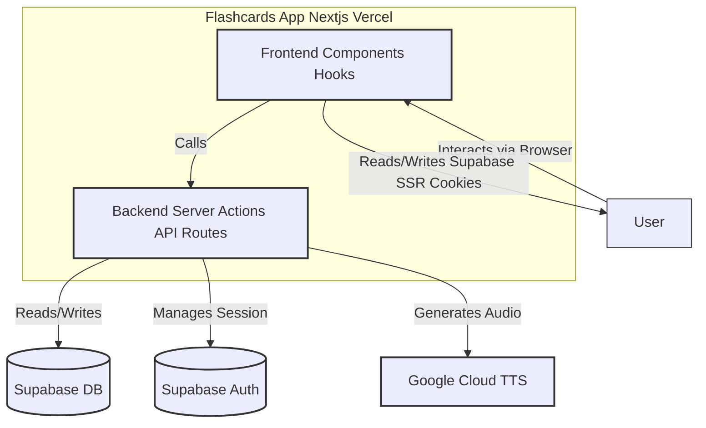
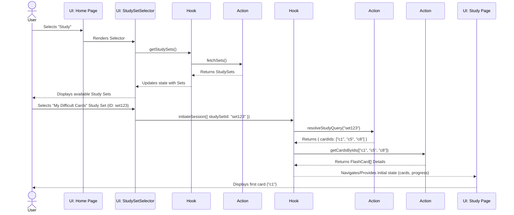
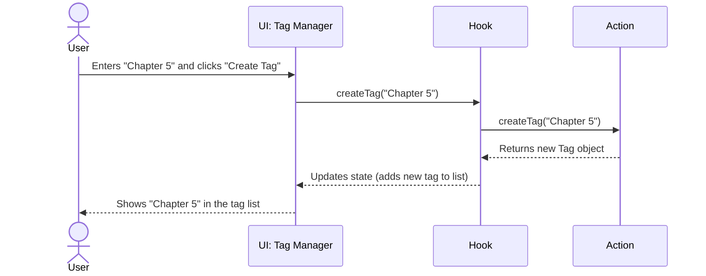
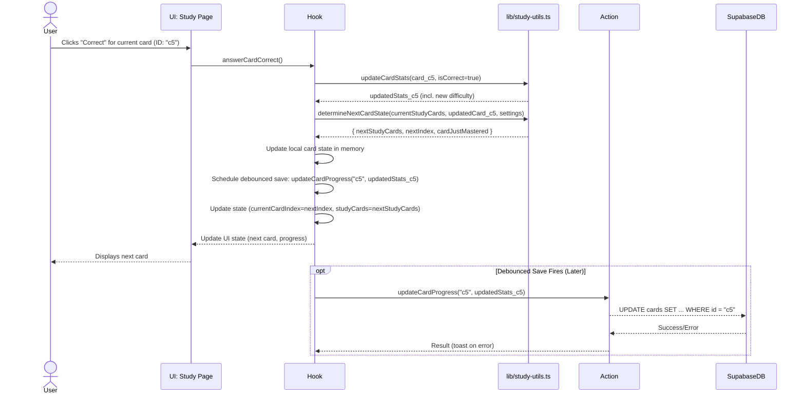

# Software Architecture Design: Query-Based Study Sets

**Version:** 1.0
**Date:** 2024-07-26

## 1. Introduction

### 1.1. Purpose
This document describes the proposed software architecture for implementing a query-based "Study Set" feature in the Flashcards App. This feature aims to enhance study flexibility by allowing users to define study sessions based on various card attributes (e.g., tags, decks, review status) rather than being limited to studying a single deck at a time.

### 1.2. Scope
This design covers changes to the data model, backend logic (Server Actions/API), frontend components, and state management required to support the creation, management, and execution of query-based study sessions. It also includes the necessary prerequisite of a card tagging system.

### 1.3. Goals
*   **Flexibility:** Allow users to study cards across multiple decks and filter by various criteria.
*   **Maintainability:** Structure the new components and logic following SOLID principles and established project patterns.
*   **Scalability:** Design the data model and queries with performance considerations for a growing number of cards and users.
*   **User Experience:** Provide an intuitive interface for defining and initiating study sessions.
*   **Consistency:** Integrate seamlessly with the existing architecture (Next.js App Router, Supabase, `@supabase/ssr`, TypeScript).

## 2. Current Architecture Recap

Based on project documentation (`docs/project-documentation.md`, `README.md`) and observed structure:

*   **Framework:** Next.js 15+ (App Router) with React 19.
*   **Backend:** Primarily serverless via Server Actions or Next.js API routes.
*   **Database:** Supabase (PostgreSQL) handling data persistence, authentication (`@supabase/ssr`), and storage. Row Level Security (RLS) is assumed to be in place.
*   **UI:** Tailwind CSS, Radix UI (via shadcn/ui).
*   **State Management:** React Context (`AuthProvider`, `SettingsProvider`), custom hooks (`useAuth`, `useDecks`, `useStudySession`).
*   **Current Study Flow:** Initiated via `/study/[deckId]`, managed by `useStudySession`, which uses `useDeckLoader` to fetch all cards for the given `deckId`.

**Note on Refactoring:** Recent refactoring efforts (as detailed in `refactoring-plan.md` and `docs/project-documentation.md`) have improved the structure of hooks (especially `useStudySession`, `useDeckLoader`, `useStudyTTS`), data services (`lib/`), authentication (`@supabase/ssr`), and components. Key improvements relevant here include the isolation of single-deck loading (`useDeckLoader`), isolated TTS logic (`useStudyTTS`), and clearer state management within `useStudySession` (though its persistence logic via `updateDeck` needs changing for this feature). This proposed architecture builds upon that improved foundation.

## 3. Proposed Architecture

### 3.1. Core Concepts

*   **Tag:** A simple label (e.g., "verb", "chapter-1", "difficult") that can be applied to one or more cards.
*   **Query Criteria:** A set of rules defining which cards should be included in a study session (e.g., `tags` include 'verb', `deckId` is 'spanish-101', `last_reviewed` > 7 days ago).
*   **Study Set:** A saved collection of Query Criteria, allowing users to easily re-run specific study configurations. Can be thought of as a "smart folder" for studying.
*   **Study Session:** An instance of studying based on either a saved `StudySet` or on-the-fly `Query Criteria`. The specific list of card IDs is resolved *at the time the session starts*.

### 3.2. High-Level Diagram (System Context)



### 3.3. Data Model Changes (Supabase PostgreSQL)

**New Tables:**

1.  **`tags`**
    *   `id`: `uuid` (Primary Key, default: `uuid_generate_v4()`)
    *   `user_id`: `uuid` (Foreign Key -> `auth.users.id`, ON DELETE CASCADE)
    *   `name`: `text` (Unique constraint per user: `UNIQUE(user_id, name)`)
    *   `created_at`: `timestamp with time zone` (default: `now()`)
    *   *RLS:* User can only manage/view their own tags.

2.  **`card_tags`** (Join Table)
    *   `card_id`: `uuid` (Foreign Key -> `cards.id`, ON DELETE CASCADE)
    *   `tag_id`: `uuid` (Foreign Key -> `tags.id`, ON DELETE CASCADE)
    *   `user_id`: `uuid` (Foreign Key -> `auth.users.id`, ON DELETE CASCADE) - *Denormalized for RLS simplicity*
    *   Primary Key: `(card_id, tag_id)`
    *   *RLS:* User can only manage/view links related to their own cards/tags.

3.  **`study_sets`**
    *   `id`: `uuid` (Primary Key, default: `uuid_generate_v4()`)
    *   `user_id`: `uuid` (Foreign Key -> `auth.users.id`, ON DELETE CASCADE)
    *   `name`: `text` (Not null)
    *   `description`: `text` (Nullable)
    *   `query_criteria`: `jsonb` (Stores the structured filter rules, Not null)
        *   *Example JSONB:* `{"includeTags": ["uuid1", "uuid2"], "excludeTags": [], "includeDecks": ["deck_uuid1"], "excludeDecks": [], "minDifficulty": 3, "maxReviewDaysAgo": 7}`
    *   `created_at`: `timestamp with time zone` (default: `now()`)
    *   `updated_at`: `timestamp with time zone` (default: `now()`)
    *   *RLS:* User can only manage/view their own study sets.

**Modified Tables:**

*   **`cards`**: 
    *   No direct column additions needed if using the `card_tags` join table.
    *   **Crucially, card-level progress/statistics (`correct_count`, `incorrect_count`, `attempt_count`, `last_studied`, `difficulty_score`) are stored directly on this table.** The query mechanism will filter based on these existing columns.
*   ~~**`study_progress` (or similar):** Need to verify if this table exists and stores card-level progress (`last_reviewed_at`, `correct_streak`, `difficulty_score`, `next_review_due`). If not, these concepts need to be added, likely to the `cards` table or a dedicated progress table linked `user_id`+`card_id`. *Assuming these exist for querying purposes.*~~
    *   *(Self-correction: Progress is confirmed to be stored on the `cards` table. No separate `study_progress` table is needed for the query criteria based on current data.)*

**Entity Relationship Diagram (ERD) (Updated):**

```mermaid
erDiagram
    USERS ||--o{ DECKS : owns
    USERS ||--o{ TAGS : owns
    USERS ||--o{ STUDY_SETS : owns
    # USERS ||--o{ STUDY_PROGRESS : tracks_progress_for -- Removed

    DECKS ||--o{ CARDS : contains

    CARDS ||--|{ CARD_TAGS : has
    # CARDS ||--o{ STUDY_PROGRESS : has_progress_for -- Removed

    TAGS ||--|{ CARD_TAGS : applied_via

    STUDY_SETS {
        uuid id PK
        uuid user_id FK
        text name
        text description
        jsonb query_criteria
        timestamptz created_at
        timestamptz updated_at
    }

    TAGS {
        uuid id PK
        uuid user_id FK
        text name
        timestamptz created_at
    }

    CARD_TAGS {
        uuid card_id PK, FK
        uuid tag_id PK, FK
        uuid user_id FK "For RLS"
    }

    CARDS {
        uuid id PK
        uuid deck_id FK
        text front_content
        text back_content
        text primary_language
        text secondary_language
        # uuid audio_ref_primary -- Assuming URLs stored directly if used
        # uuid audio_ref_secondary -- Assuming URLs stored directly if used
        integer correct_count
        integer incorrect_count
        integer attempt_count
        timestamptz last_studied
        float difficulty_score
        timestamptz created_at
        timestamptz updated_at
    }

    # STUDY_PROGRESS { -- Removed
    #    uuid user_id PK, FK
    #    uuid card_id PK, FK
    #    integer correct_streak
    #    timestamptz last_reviewed_at
    #    timestamptz next_review_due
    #    float difficulty_score
    # }
```

### 3.4. Backend Changes (Server Actions Preferred)

*   **`tagActions.ts`**:
    *   `createTag(name: string): Promise<Tag>`
    *   `getTags(): Promise<Tag[]>`
    *   `updateTag(id: string, name: string): Promise<Tag>`
    *   `deleteTag(id: string): Promise<void>`
    *   `addTagToCard(cardId: string, tagId: string): Promise<void>`
    *   `removeTagFromCard(cardId: string, tagId: string): Promise<void>`
    *   `getTagsForCard(cardId: string): Promise<Tag[]>`
*   **`studySetActions.ts`**:
    *   `createStudySet(data: { name: string; description?: string; query_criteria: object }): Promise<StudySet>`
    *   `getStudySets(): Promise<StudySet[]>`
    *   `getStudySetById(id: string): Promise<StudySet | null>`
    *   `updateStudySet(id: string, data: Partial<{ name; description; query_criteria }>): Promise<StudySet>`
    *   `deleteStudySet(id: string): Promise<void>`
*   **`studyQueryActions.ts`**:
    *   `resolveStudyQuery(criteria: object | string): Promise<{ cardIds: string[] }>`
        *   Accepts either a `query_criteria` object (for on-the-fly sessions) or a `studySetId` string (fetches criteria from `study_sets` table).
        *   Constructs and executes a potentially complex Supabase SQL query using the Supabase server client.
        *   The query must join `cards`, `decks` (if filtering by deck), and `card_tags` (if filtering by tags). It will filter based on criteria like tag IDs, deck IDs, and progress attributes directly on the `cards` table (`last_studied`, `difficulty_score`, etc.), all constrained by `user_id`.
        *   **Recommendation:** Encapsulate the query logic within a Supabase Database Function (`pl/pgsql`) for complexity management, performance optimization, and easier maintenance. The Server Action would then call this function.
        *   Applies RLS implicitly via Supabase client.
        *   Returns an array of `card.id`s matching the criteria for the current user. Needs careful indexing on queried columns (`user_id`, `deck_id`, `last_studied`, `difficulty_score` on `cards`; `user_id`, `tag_id`, `card_id` on `card_tags`).
*   **`cardActions.ts`**:
    *   `getCardsByIds(cardIds: string[]): Promise<FlashCard[]>`
        *   Fetches full card details for a given list of card IDs.
        *   Ensures RLS is applied (user can only fetch their own cards, though this might be implicit if `cardIds` are resolved correctly).
        *   Used by `useStudySession` after resolving the query.
*   **`progressActions.ts`**:
    *   `updateCardProgress(cardId: string, stats: { correctCount?: number; incorrectCount?: number; attemptCount?: number; lastStudied?: Date; difficultyScore?: number }): Promise<void>`
        *   Updates only the specified progress fields for a single card.
        *   Crucial for efficient updates during query-based study sessions, avoiding unnecessary updates to entire decks.
        *   Performs validation and applies RLS.

### 3.5. Frontend Changes

**New Components:**

*   `components/study/StudySetBuilder.tsx`: UI form to define `query_criteria` (selecting decks, tags, filters).
*   `components/study/StudySetSelector.tsx`: UI to choose a saved `StudySet` or initiate an on-the-fly query.
*   `components/tags/TagManager.tsx`: UI for users to create/edit/delete their tags.
*   `components/tags/CardTagEditor.tsx`: UI (likely integrated into `/app/edit/[deckId]/page.tsx`) to add/remove tags from specific cards.

**Modified Components:**

*   `app/page.tsx` (or new `/study/select` page): Integrate `StudySetSelector` to allow users to start sessions.
*   `app/edit/[deckId]/page.tsx`: Integrate `CardTagEditor`.
*   `app/study/[sessionId]/page.tsx` (or similar refactor): The study interface page.
    *   Will be initiated with a list of card IDs resolved from the query, not just a `deckId`.
    *   URL might change (e.g., `/study/session/[sessionId]` where `sessionId` refers to a temporary session state or `/study?cardIds=...`, though the latter might hit URL length limits).

**New Hooks:**

*   `hooks/useStudySets.ts`: Provides functions for CRUD operations on `study_sets` by calling Server Actions. Manages related state (list of sets, loading, errors).
*   `hooks/useTags.ts`: Provides functions for CRUD operations on `tags` and managing `card_tags`. Manages tag-related state.

**Modified Hooks:**

*   `hooks/useStudySession.ts`: Major refactoring needed.
    *   **Initialization:** Takes `queryCriteria` object or `studySetId` string as input instead of `deckId`.
    *   **Card ID Resolution:** Calls `studyQueryActions.resolveStudyQuery` to get the initial list of `cardIds` for the session.
    *   **Card Data Fetching:** Calls the new `cardActions.getCardsByIds` server action to fetch the full `FlashCard` data for the resolved IDs. **It no longer uses `useDeckLoader`.**
    *   **State Management:** Manages the study flow (current card, card queue, progress) based on the dynamically fetched list of cards. `lib/study-utils.ts` helpers remain relevant.
    *   **Persistence:** Calls the new `progressActions.updateCardProgress` server action (likely debounced, similar to the current `updateDeck` call) after each card is answered to save the updated statistics for *that specific card*. **It no longer calls `useDecks.updateDeck` for session progress.**
    *   **Dependencies:** Now depends on `useSettings`, `useStudyTTS`, `studyQueryActions`, `cardActions`, `progressActions`. Dependency on `useDecks` is removed for core session logic (unless needed for other reasons, like accessing deck metadata if required later).

**Component Interaction Diagram (Updated):**

```mermaid
graph TD
    subgraph "Frontend UI"
        direction LR
        HomePage[Homepage Study Selection]
        StudySetBuilderUI[Study Set Builder UI]
        StudySetSelectorUI[Study Set Selector UI]
        StudyPage[Study Session Page]
        CardEditor[Card Editor Page]
        TagManagerUI[Tag Manager UI]
    end

    subgraph "Frontend Hooks"
        direction LR
        useAuth[useAuth]
        useStudySets[useStudySets]
        useTags[useTags]
        useStudySession[useStudySession Refactored]
    end

    subgraph BackendServerActions
        direction LR
        tagActions[tagActions]
        studySetActions[studySetActions]
        studyQueryActions[studyQueryActions]
        cardActions[cardActions]
        progressActions[progressActions]
    end

    %% UI to Hooks
    HomePage --> useStudySets
    HomePage --> useStudySession
    StudySetBuilderUI --> useStudySets
    StudySetSelectorUI --> useStudySets
    StudySetSelectorUI --> useStudySession
    StudyPage --> useStudySession
    CardEditor --> useTags
    TagManagerUI --> useTags

    %% Hooks to Actions
    useStudySets --> studySetActions
    useTags --> tagActions
    useStudySession --> studyQueryActions
    useStudySession --> cardActions # To get card data
    useStudySession --> progressActions # To update card progress

    %% User Authentication Implicit via useAuth middleware
    useAuth -- Provides User Context --> Frontend Hooks
    Backend -- Uses Auth Context --> SupabaseDB[(Supabase DB)]

    classDef ui fill:#e1f5fe,stroke:#0277bd,stroke-width:1px;
    classDef hook fill:#e8f5e9,stroke:#2e7d32,stroke-width:1px;
    classDef action fill:#fff3e0,stroke:#ef6c00,stroke-width:1px;
    class HomePage,StudySetBuilderUI,StudySetSelectorUI,StudyPage,CardEditor,TagManagerUI ui;
    class useAuth,useStudySets,useTags,useStudySession hook;
    class tagActions,studySetActions,studyQueryActions,cardActions,progressActions action;

```

### 3.6. Key Interaction Flows (Sequence Diagrams)

**1. Starting a Study Session (Saved Study Set) (Updated):**



**2. Creating a Tag:**



**3. Answering a Card (New Sequence Diagram):**


## 4. Technology Choices

*   **Backend Logic:** Primarily Next.js Server Actions for tight integration with frontend components and simplified auth handling via `@supabase/ssr`.
*   **Database:** Supabase PostgreSQL. Leverage JSONB for `query_criteria`. **Strongly consider DB functions (`pl/pgsql`) for complex `resolveStudyQuery` logic.**
*   **Querying:** Supabase JavaScript client library (`@supabase/supabase-js`) within Server Actions to build and execute queries (or call DB functions), respecting RLS.
*   **Frontend:** React, TypeScript, Tailwind CSS, shadcn/ui (consistent with existing stack).
*   **State Management:** Continue using custom hooks and React Context where appropriate. `useStudySets`, `useTags` will encapsulate data fetching and state for their domains. `useStudySession` remains central to the active study experience, adapted for query results.

## 5. Non-Functional Requirements

*   **Security:** RLS policies must be meticulously defined for `tags`, `card_tags`, and `study_sets` to ensure users can only access/modify their own data. Server Actions (`tagActions`, `studySetActions`, `studyQueryActions`, `cardActions`, `progressActions`) must validate inputs and operate under user context.
*   **Performance:** The `resolveStudyQuery` action/function is critical. Database queries must be optimized with appropriate indexes on `cards` (especially `user_id`, `deck_id`, `last_studied`, `difficulty_score`) and `card_tags` (`user_id`, `tag_id`, `card_id`). Consider potential performance impact of complex JSONB queries or joins. Using a DB function for the main query resolution is highly recommended for optimization and maintainability.
*   **Maintainability:** Code should adhere to SOLID principles, be well-typed (TypeScript), follow project conventions (linting, formatting), and include TSDoc documentation. Separate concerns between UI components, hooks, and server actions.
*   **Testability:** Server Actions should be testable. Hooks should be designed for testability (e.g., using dependency injection for fetching functions if needed). Implement unit and integration tests.

## 6. Implementation Considerations

*   **Phased Rollout:**
    1.  Implement the Tagging system first (data model, backend actions, UI in editor).
    2.  Implement the `StudySet` entity and the core query resolution (`resolveStudyQuery` action, potentially with DB function). Test thoroughly.
    3.  Implement the `cardActions.getCardsByIds` and `progressActions.updateCardProgress` actions.
    4.  Refactor `useStudySession` and the study page UI to consume the new query mechanism, card fetching, and progress update actions.
    5.  Build the UI for creating/managing `StudySets` (`StudySetBuilder`, `StudySetSelector`).
*   **Tagging UI:** Needs careful design for usability within the card editing flow.
*   **Query Builder UI (`StudySetBuilder`):** Requires a user-friendly interface to construct potentially complex queries without overwhelming the user.
*   **Data Migration:** No significant data migration is needed for existing cards/decks, but users will need to start adding tags.
*   **Progress Update Action:** Implementing `progressActions.updateCardProgress` is essential to avoid inefficiently updating entire decks when only a single card's progress changes in a cross-deck study session.

## 7. Future Considerations

*   Sharing Study Sets between users.
*   More advanced query operators (e.g., date ranges, regular expressions on content).
*   System-generated Study Sets (e.g., "Due for Review Today").
*   Analytics on Study Set usage. 
