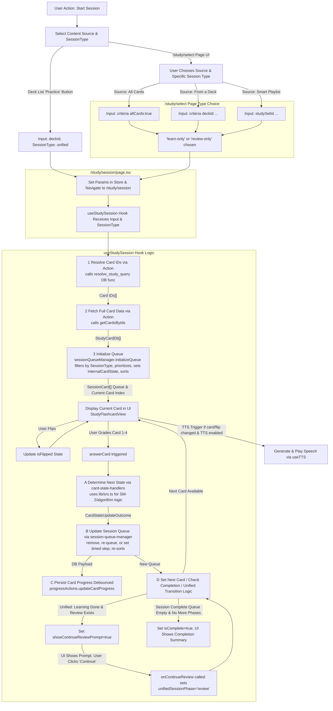

# Table of Contents

1.  [High-Level Concept: Prepare vs. Practice](#1-high-level-concept-prepare-vs-practice)
2.  [Detailed Functional Logic (Extensive Version)](#2-detailed-functional-logic-extensive-version)
    *   [2.1. Content Preparation](#21-content-preparation)
        *   [2.1.1. Deck Management](#211-deck-management)
            *   [2.1.1.1. Manual Deck Creation](#2111-manual-deck-creation)
            *   [2.1.1.2. AI-Powered Deck Creation (from Files/Images)](#2112-ai-powered-deck-creation-from-filesimages)
            *   [2.1.1.3. Editing Decks (`/edit/[deckId]` page)](#2113-editing-decks-editdeckid-page)
            *   [2.1.1.4. Viewing Decks ("Your Decks" page - `/`)](#2114-viewing-decks-your-decks-page--)
            *   [2.1.1.5. Deleting Decks](#2115-deleting-decks)
        *   [2.1.2. Tag Management](#212-tag-management)
            *   [2.1.2.1. Global Tags (`/tags` page)](#2121-global-tags-tags-page)
            *   [2.1.2.2. Assigning Tags to Decks](#2122-assigning-tags-to-decks)
        *   [2.1.3. Smart Playlist (Study Set) Management](#213-smart-playlist-study-set-management)
            *   [2.1.3.1. Creation/Editing (`/study/sets/new`, `/study/sets/[id]/edit`)](#2131-creationediting-studysetsnew-studysetsidedit)
                *   Uses `StudySetBuilder` component and `useStudySetForm` hook.
                *   Actions: `studySetActions.createStudySet`, `studySetActions.updateStudySet`.
                *   Filter criteria (`StudyQueryCriteria` from `lib/schema/study-query.schema.ts`):
                    *   Deck(s), Tags (Include/Exclude, Any/All for deck tags).
                    *   Date ranges (Created, Updated, Last Reviewed, Next Due - including 'never', 'isDue').
                    *   SRS Level (equals, <, >).
                    *   `includeLearning`: Filters for `srs_level = 0` AND (`learning_state IS NULL` OR `learning_state = 'learning'`).
            *   [2.1.3.2. Viewing Playlists (`/study/sets` page)](#2132-viewing-playlists-studysets-page)
                *   Uses `StudySetListClient.tsx`. Data fetched server-side.
                *   Lists saved Study Sets. Provides "Learn" / "Review" buttons.
    *   [2.2. Content Practice (Studying)](#22-content-practice-studying)
        *   [Mermaid Process Flow Diagram](#22-content-practice-studying)
        *   [2.2.1. Study Session Details (Technical Flow)](#221-study-session-details-technical-flow)
            *   [2.2.1.1. Study Session Initiation](#2211-study-session-initiation)
            *   [2.2.1.2. Study Session Execution (`useStudySession` Hook & `app/study/session/page.tsx`)](#2212-study-session-execution-usestudysession-hook--appstudysessionpagetsx)
            *   [2.2.1.3. User Settings (`/settings` page)](#2213-user-settings-settings-page)
                *   [2.2.1.3.1. Study Algorithm](#22131-study-algorithm)
                *   [2.2.1.3.2. Language & Font](#22132-language--font)
                *   [2.2.1.3.3. TTS & Dialects](#22133-tts--dialects)
                *   [2.2.1.3.4. Color Coding & Palette](#22134-color-coding--palette)
                *   [2.2.1.3.5. Deck Progress & Theme](#22135-deck-progress--theme)
3.  [Simplified Functional Logic (For a Student)](#3-simplified-functional-logic-for-a-student)
    *   [3.1. Getting Your Stuff Ready (Prepare)](#31-getting-your-stuff-ready-prepare)
    *   [3.2. Time to Study! (Practice)](#32-time-to-study-practice)

# StudyCards App: Functional Logic Overview

This document outlines the core functional logic of the StudyCards application, covering how users interact with the app from content preparation to active study sessions.

## 1. High-Level Concept: Prepare vs. Practice

The app is conceptually divided into two main activities:

*   **Prepare:** Everything related to creating, organizing, and managing your study materials. This includes:
    *   Creating and managing Decks of flashcards.
    *   Creating and editing individual flashcards within those decks.
    *   Generating flashcards automatically from documents/images using AI.
    *   Organizing cards with Tags.
    *   Creating "Smart Playlists" (formally called Study Sets) to define custom groups of cards to study based on various filters.
*   **Practice:** The active learning and review process using the materials you've prepared. This involves:
    *   Starting study sessions.
    *   Interacting with flashcards (viewing, flipping, grading your recall).
    *   Letting the app's Spaced Repetition System (SRS) schedule cards for optimal review.

---

## 2. Detailed Functional Logic (Extensive Version)

### 2.1. Content Preparation

#### 2.1.1. Deck Management

##### 2.1.1.1. Manual Deck Creation
*   User clicks "Create Deck" (typically on the main "Your Decks" page, which navigates to `/decks/new` - formerly `/decks/create-choice`).
*   The `/decks/new` page offers options like "Create Manually". Choosing this leads to a form.
*   User fills in Deck Name, Primary Language, and (if bilingual) Secondary Language.
*   Upon submission (which hits `POST /api/decks`), a new, empty deck is created in the database.
*   The user is redirected to the "Edit Deck" page (`/edit/[newDeckId]`) for this new deck to start adding cards.

##### 2.1.1.2. AI-Powered Deck Creation (from Files/Images)
*   User navigates to the "AI Flashcards" page (e.g., `/prepare/ai-generate` or via an option on `/decks/new`).
*   User uploads PDF or image files.
*   The system processes these files (client calls `POST /api/extract-pdf`):
        *   Extracts text (using Google Cloud Vision/Document AI).
        *   Sends extracted text to an AI model (Google Gemini via `flashcardGeneratorService`) to generate initial question/answer pairs and detect if the content is primarily for "translation" or "knowledge" acquisition.
*   User reviews the AI-generated flashcards, detected mode, and languages on the client.
*   **Conditional Step (Mode Confirmation/Refinement):**
        *   If the AI detects "translation" mode, the user might be prompted.
        *   User can choose to "Add Grammar Details" (client calls `POST /api/process-ai-step2` with action `classify`) or "Change to Knowledge Mode" (client calls `POST /api/process-ai-step2` with action `force_knowledge`).
*   User provides a name for the new deck on the client.
*   Upon submission (client calls `POST /api/decks`), a new deck is created with the chosen name and languages, and the (potentially refined) AI-generated flashcards are saved into it.
*   User is redirected to the "Edit Deck" page (`/edit/[newDeckId]`).

##### 2.1.1.3. Editing Decks (`/edit/[deckId]` page)
*   Uses `useEditDeck` hook.
*   Users can modify deck metadata (name, languages, bilingual status). Changes are auto-saved (debounced) via `deckActions.updateDeck`.
*   Users can manage cards within the deck:
    *   **Add New Cards:** Manually via UI elements that call `cardActions.createCard`.
    *   **Edit Existing Cards:** Modify question, answer, and grammatical classifications. Changes are auto-saved (debounced) via `cardActions.updateCard`.
    *   **Delete Cards:** Via `cardActions.deleteCard`.
*   Users can assign/unassign global tags to the deck via `tagActions.addTagToDeck` / `removeTagFromDeck`.
*   **Export to PDF:** Users can click a "Save to PDF" button to download the deck's content.
    *   The PDF will include the deck title, tags, and questions/answers in a two-column format.
    *   It uses the user's selected card font, and supports optional word color coding and adjustable Q&A font size (configured in Settings).
    *   Optionally, icons indicating card status (new, relearning) can be included.
    *   The PDF features page numbers, a "Created by StudyCards on <date>" mark, and a legend for status icons.

##### 2.1.1.4. Viewing Decks ("Your Decks" page - `/`)
*   Uses `DeckListClient.tsx`. Data is fetched server-side by `app/page.tsx` using `deckActions.getDecksWithSrsCounts`.
*   Displays a list of all user-created decks.
*   Shows deck name, card count (total from SRS stages), languages.
*   Displays a progress bar (if enabled in settings) using `DeckProgressBar`, showing card distribution across SRS stages (New, Learning, Relearning, Young, Mature – *Note: current `get_decks_with_complete_srs_counts` DB function needs update to return 'relearning' count for this progress bar if desired*).
*   Provides a single "Practice" button for each deck, displaying total `learn_eligible_count + review_eligible_count`.

##### 2.1.1.5. Deleting Decks
*   From the "Edit Deck" page's "Danger Zone", calling `deckActions.deleteDeck`. This cascades to delete cards.

#### 2.1.2. Tag Management

##### 2.1.2.1. Global Tags (`/tags` page)
*   Uses `TagManagerClient.tsx`.
*   Users create new global tags (via `tagActions.createTag`).
*   Users delete existing global tags (via `tagActions.deleteTag`).

##### 2.1.2.2. Assigning Tags to Decks
*   (As described in Deck Editing)

#### 2.1.3. Smart Playlist (Study Set) Management

##### 2.1.3.1. Creation/Editing (`/study/sets/new`, `/study/sets/[id]/edit`)
*   Uses `StudySetBuilder` component and `useStudySetForm` hook.
*   Actions: `studySetActions.createStudySet`, `studySetActions.updateStudySet`.
*   Filter criteria (`StudyQueryCriteria` from `lib/schema/study-query.schema.ts`):
    *   Deck(s), Tags (Include/Exclude, Any/All for deck tags).
    *   Date ranges (Created, Updated, Last Reviewed, Next Due - including 'never', 'isDue').
    *   SRS Level (equals, <, >).
    *   `includeLearning`: Filters for `srs_level = 0` AND (`learning_state IS NULL` OR `learning_state = 'learning'`).

##### 2.1.3.2. Viewing Playlists (`/study/sets` page)
*   Uses `StudySetListClient.tsx`. Data fetched server-side.
*   Lists saved Study Sets. Provides "Learn" / "Review" buttons.

### 2.2. Content Practice (Studying)

Orchestrated by `useStudySession` hook, `app/study/session/page.tsx`, and utility modules.

#### 2.2.1. Study Session Details (Technical Flow)

##### 2.2.1.1. Study Session Initiation
- **From Deck List ("Your Decks" - / page, via DeckListClient.tsx):**
  - User clicks the "Practice" button on a specific deck.
  - This button shows the sum of `learn_eligible_count` and `review_eligible_count` (from `get_decks_with_complete_srs_counts` DB function).
  - `StudySessionInput` is `{ deckId: 'selected-deck-id' }`.
  - `SessionType` is `'unified'`.
  - These are set in `useStudySessionStore`.
  - Navigate to `/study/session`.
- **From Smart Study Setup (`/study/select` page, via StudySetSelector.tsx and StudySelectClient.tsx):**
  - User selects a content source:
    - "All My Cards" (results in `StudySessionInput { criteria: { allCards: true, tagLogic: 'ANY' } }`).
    - "From a Deck" (results in `StudySessionInput { criteria: { deckId: '...', tagLogic: 'ANY' } }`).
    - "Smart Playlist" (results in `StudySessionInput { studySetId: '...' }`).
  - User chooses a "Study Type" radio button:
    - "Learn New": Sets `SessionType: 'learn-only'`.
    - "Review Due (SRS)": Sets `SessionType: 'review-only'`.
  - The chosen `StudySessionInput` and `SessionType` are set in `useStudySessionStore`.
  - Navigate to `/study/session`.

##### 2.2.1.2. Study Session Execution (`useStudySession` Hook & `app/study/session/page.tsx`)
- **Data Loading & Queue Preparation (orchestrated by useStudySession):**
  - Receives `initialInput` and `sessionType` from store/props.
  - Calls `resolveStudyQuery` action:
    - The DB function filters by `p_user_id` and `initialInput` (e.g., `deckId`, `studySetId`, or complex criteria including the `includeLearning` flag which filters for `srs_level = 0` AND (`learning_state IS NULL` OR `learning_state = 'learning'`)).
  - Calls `getCardsByIds` action to fetch full `StudyCardDb` data.
  - Calls `sessionQueueManager.initializeQueue(fetchedCards, sessionType, settings)`:
    - **Filtering by sessionType:**
      - `learn-only`: Keeps cards with `srs_level = 0` AND `learning_state IS DISTINCT FROM 'relearning'`.
      - `review-only`: Keeps cards with (`srs_level >= 1` OR (`srs_level = 0` AND `learning_state = 'relearning'`)) AND `next_review_due <= NOW()`.
      - `unified`: Keeps cards meeting either learn-only OR review-only conditions.
    - **InternalCardState Initialization:**
      - Sets initial `streak=0`, `dueTime` (now for learn-eligible, actual `next_review_due` for review-eligible), `failedAttemptsInLearnSession=0`, `hardAttemptsInLearnSession=0`, `originalSrsLevelOnLoad`.
      - For new cards (`learning_state IS NULL`) in a learn/unified session, their `learning_step_index` for the session starts at 0.
    - **Sorting:**
      - For 'unified', learn-eligible cards are placed first, then all by `dueTime`.
      - Others just by `dueTime`.
- **Card Presentation & Interaction:**
  - Handled by `app/study/session/page.tsx` & `StudyFlashcardView.tsx`.
  - Next card from queue (determined by `findNextCardIndex`) is displayed.
  - User flips card.
  - TTS speaks question/answer if enabled (logic refined to re-speak question on flip-back).
  - User grades recall (Again, Hard, Good, Easy).
- **State Update & SRS Logic** (orchestrated by useStudySession, logic in `card-state-handlers.ts` using `lib/srs.ts`):
  - `answerCard` in useStudySession calls the appropriate handler based on the card's current state (`learning_state`, `srs_level`).
  - **handleInitialLearningAnswer** (for `srs_level = 0`, `learning_state IS NULL` or `'learning'`):
    - If `settings.studyAlgorithm` is `'dedicated-learn'`: Uses streak. Graduation to `srs_level = 1` (state null) on masteryThreshold or "Easy". EF calculation uses DB `failed_attempts_in_learn`/`hard_attempts_in_learn`. Non-graduated cards re-queued in session.
    - If `settings.studyAlgorithm` is `'standard-sm2'`: Uses timed steps (`initialLearningStepsMinutes`). Graduation to `srs_level = 1` on completing steps or "Easy". EF calculation similar. Non-graduated cards update step/dueTime in session.
    - Sets `dbUpdatePayload.learning_state = 'learning'` for cards staying in this phase (if they were new). Updates relevant attempt counters for EF calculation.
  - **handleRelearningAnswer** (for `srs_level = 0`, `learning_state = 'relearning'`):
    - Uses timed steps (`relearningStepsMinutes`). Graduation back to `srs_level = 1` (state null).
  - **handleReviewAnswer** (for `srs_level >= 1`, `learning_state IS NULL`):
    - Uses `calculateSm2State`.
    - Grade 1 (Again) -> Lapse: `srs_level = 0`, `learning_state = 'relearning'`, EF penalized, enters relearning steps.
    - Grade >=2 -> SM-2 update of EF, interval, `next_review_due`.
  - **Persistence:**
    - `CardStateUpdateOutcome.dbUpdatePayload` (with all SRS fields, counts, `last_reviewed_at`, `last_review_grade`) is sent to `progressActions.updateCardProgress` (debounced).
- **Queue Management** (`session-queue-manager.ts`):
  - `updateQueueAfterAnswer` uses `CardStateUpdateOutcome.queueInstruction` to modify and re-sort the sessionQueue.
- **Session Progression & Unified Flow:**
  - `useStudySession` manages `currentCardIndex` using `findNextCardIndex`.
  - Timer managed using `getNextDueCheckDelay`.
  - **Unified Session:**
    - `unifiedSessionPhase` is initialized based on whether learning-eligible cards exist in the initial queue.
    - When `answerCard` processing for a 'unified' session in 'learning' phase determines no more learning cards are left in the nextQueue:
      - If review cards exist, `showContinueReviewPrompt` becomes true.
      - User clicks "Continue" -> `onContinueReview` called -> `unifiedSessionPhase` becomes 'review', hook advances to next (review) card.
      - If no review cards, `unifiedSessionPhase` becomes 'complete'.
  - **Session Completion:**
    - `isComplete` becomes true when queue is empty and no further phases/prompts. Summary displayed.

##### 2.2.1.3. User Settings (`/settings` page)

###### 2.2.1.3.1. Study Algorithm
- Study Algorithm: `'dedicated-learn'` vs `'standard-sm2'` (UI for this is Task 4.4 - Deferred).
- Algorithm Parameters (e.g., `masteryThreshold`, intervals, penalties) (UI for this is Task 4.4 - Deferred).

###### 2.2.1.3.2. Language & Font
- Native language
- Card font

###### 2.2.1.3.3. TTS & Dialects
- TTS (enabled/dialects)

###### 2.2.1.3.4. Color Coding & Palette
- Word Color Coding
- Palette configuration
- Color only for non-native language

###### 2.2.1.3.5. Deck Progress & Theme
- Appearance (Theme, Show Deck Progress)

- Settings are saved to the database and applied globally.

---

## 3. Simplified Functional Logic (For a Student)

### 3.1. Getting Your Stuff Ready (Prepare)

Imagine StudyCards is your smart study buddy!

- **Decks are like Piles of Flashcards:**
  - You can make decks for different subjects (e.g., "French Vocab Deck," "History Chapter 5 Deck").
- **Make them Yourself:**
  - Go to "Create Deck."
  - Choose "Create Manually."
  - Fill in details, then add your questions and answers.
- **Let AI Help:**
  - Go to "Create Deck."
  - Choose "Generate from File/Image."
  - Upload your notes (PDFs) or pictures.
  - StudyCards will try to make flashcards for you!
  - You can check them and even ask the AI to add grammar details or change the style.
- **Tags are like Labels:**
  - You can create labels (e.g., "Chapter 1," "Hard Verbs") on the "Manage Tags" page.
  - When editing a deck, you can add these labels to it.
- **Smart Playlists are Custom Mixes:**
  - Want to study only French verbs from Chapter 1 that are due soon?
  - Create a "Smart Playlist!"
  - You tell it what to look for (deck, tags, how new/old the cards are, if they are due), give it a name, and it makes a special study list for you.
- **Save Your Deck as a PDF:**
  - When you're editing a deck, you can save it as a PDF file to view or print. It will have your questions, answers, and even use the special fonts or colors you like!

### 3.2. Time to Study! (Practice)

- **Picking What to Study:**
  - **From "Your Decks" Page:**
    - Each deck has a "Practice" button.
    - This button is smart! It will first show you any brand new cards or cards you're still learning in that deck.
    - Once you're done with those, if there are older cards you've learned before that are due for review (so you don't forget!), the app will ask if you want to study them. It's all one smooth session!
  - **From "Start Session" Page:**
    - Here you have more control.
    - You can pick "All My Cards," a specific Deck, or one of your Smart Playlists.
    - Then choose:
      - "Learn New": Perfect for focusing only on brand new cards or those you're actively learning.
      - "Review Due (SRS)": Shows only the cards that the app's "Spaced Repetition System" (SRS) thinks you need to see again to help you remember them long-term.
- **The Study Screen:**
  - You'll see one side of a flashcard (the question).
  - **Flip It!** Click the card to see the answer.
  - **How did you do?** Four buttons:
    - "Again" (Oops!)
    - "Hard" (Tough one!)
    - "Good" (Got it!)
    - "Easy" (Super easy!)
  - **Smart Scheduling (SRS):**
    - Based on your answer, StudyCards figures out the best time to show you that card next.
    - If you know it well, you won't see it for a while.
    - If it's hard, you'll see it sooner. This helps you study efficiently!
  - **Listen Up! (TTS):**
    - If you turn on Text-to-Speech in settings, the app can read the questions and answers out loud.
    - It will even try to use the right accent if you set it up!
  - **Finishing Up:**
    - When you're done, you'll see a summary of your session.
- **In short:**
  - Get your cards ready (manually or with AI), organize them, and then use the "Practice" or "Start Session" options.
  - StudyCards uses smarts (SRS) to help you learn efficiently and remember things for longer!
