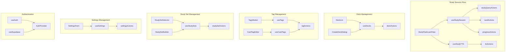

# Project Documentation

**Version:** 2.2 (Consolidated Documentation)
**Date:** 2024-04-05

## 1. Executive Summary

### Purpose and Objectives
The Flashcards App is a modern, multilingual learning platform designed to help users create and study flashcards efficiently and effectively. The project aims to enhance the learning experience through:
- Interactive flashcard creation and management.
- Flexible, query-based study sessions using tags, deck affiliation, and other criteria.
- Implementation of proven Spaced Repetition System (SRS) algorithms (initially SM-2, expandable to FSRS) for optimized long-term retention.
- Multi-modal learning via integrated Text-to-Speech (TTS) audio support.
- Progress tracking and user-configurable settings.

### Target Users and Main Use Cases
- Language learners improving vocabulary (using audio, tags like 'verb', 'noun').
- Students studying any subject matter (organizing by chapter tags, studying due cards).
- Teachers creating and organizing study materials (using decks and tags).
- Self-learners requiring an organized and efficient study system (using query-based study sets like "difficult items" or "review all due").
- Users with specific learning needs (Dyslexia, ADHD) benefiting from structured SRS, audio, and clear UI (addressed via separate accessibility features).

### Business Value and Expected Outcomes
- **Improved Learning Efficiency:** Through optimized SRS scheduling and focused query-based study.
- **Enhanced Retention:** Through active recall, spaced repetition, and multi-modal learning (text + audio).
- **Increased User Engagement:** Through progress tracking, flexible study options, and customizable settings (like SRS algorithm choice).
- **Flexible Learning Environment:** Supporting multiple languages, diverse content, and personalized study workflows.

## 2. Business Context

### Problem Statement
Traditional flashcard methods and simpler apps often lack the flexibility, efficiency, and features needed for modern, optimized learning:
- Limited accessibility across devices.
- No or basic audio support for pronunciation.
- Difficulty in tracking granular progress and understanding memory decay.
- Inflexible study options (often limited to single decks).
- Lack of robust, evidence-based spaced repetition integrated seamlessly.
- Difficulty studying related concepts across different decks or focusing on specific card types (e.g., only difficult cards, only due cards).

### Key Stakeholders
- End Users (students, language learners, self-learners)
- Content Creators (teachers, education professionals)
- Platform Administrators
- Development Team

### User Personas
1. Language Learner
   - Primary need: Vocabulary acquisition with pronunciation and context.
   - Key features: TTS, bilingual cards, tagging ('verbs', 'idioms'), SRS.
2. Student
   - Primary need: Subject matter revision and long-term retention.
   - Key features: Progress tracking, deck organization, query-based study (due cards, chapter tags), SRS.
3. Teacher
   - Primary need: Content creation and organization.
   - Key features: Deck management, multi-language support, tagging for structure.

### Business Workflows
1. User Registration and Authentication
2. Deck Creation and Management
3. Tag Creation and Management (Assigning tags to cards)
4. Study Set Creation and Management (Defining query criteria)
5. Study Session Initiation (User selects Card Set + Study Mode)
6. Study Session Execution (System presents cards based on Mode)
7. Card Review and SRS Update (Answering card, system calculates next review, saves state)
8. Progress Tracking and Analytics (Overall stats, card-level SRS state)
9. User Settings Management (Including SRS algorithm preference)
10. Content Sharing and Collaboration (Future)

## 3. Functional Overview

### Main Features and Modules
1. Authentication System
   - Sign up/Login, Profile management, OAuth integration.
2. Deck Management
   - Create/Edit/Delete decks, Import/Export, Categorization.
3. Tag Management
    - Create/Edit/Delete user-specific tags.
    - Assign/Remove tags from cards.
4. Study Set Management ("Smart Playlists")
    - Create/Edit/Delete named study sets based on query criteria.
    - Query criteria include tags (include/exclude), decks (include/exclude), date added/modified, language, etc.
5. Study System
   - Interactive study sessions based on flexible **Card Selections** (Deck, All Cards, Tags, Study Sets) and distinct **Study Modes**.
   - **Study Modes:**
        - **Learn Mode:** Comprehensive review of selected cards with session-based completion criteria.
        - **Review Mode:** SRS-prioritized review focusing only on cards due according to their `next_review_due` date.
   - **Spaced Repetition System (SRS):**
        - User-selectable algorithm (via Settings), starting with SM-2.
        - Automatic calculation of next review date based on user performance (grade) and chosen algorithm.
        - Card-level storage of SRS state (`next_review_due`, `srs_level`, `easiness_factor`, etc.).
        - **SRS state updated consistently regardless of Study Mode.**
   - Progress tracking (overall and per card).
   - Flippable card interface.
6. Audio Support
   - Text-to-speech integration (Google Cloud TTS).
   - Multiple language support & voice customization.
7. User Settings
    - General preferences (e.g., session completion threshold `X` for Learn Mode).
    - SRS Algorithm selection ('sm2', 'fsrs' - future).
    - TTS preferences.

### Key User Interactions
1. Card Creation/Editing Flow
   - Enter content, select languages, assign/remove tags, generate audio.
2. Tag Management Flow
    - Create new tag (e.g., "Chapter 3").
    - View/Edit/Delete existing tags.
3. Study Set Creation Flow ("Smart Playlist")
    - Name the set (e.g., "Hard Verbs Chapter 1").
    - Define query criteria using UI (e.g., Tags: include 'verb', Deck: 'Chapter 1', Added Date: newer than 14 days).
    - Save the Study Set.
4. Study Session Initiation Flow
   - **Step 1: Select Cards:** Choose a Deck, "All Cards", a Tag, or a saved Study Set/Smart Playlist.
   - **Step 2: Select Study Mode:** Choose "Learn Mode" or "Review Mode".
   - Click "Start Studying".
5. Study Session Execution Flow (depends on mode)
   - System resolves query -> gets initial Card IDs.
   - System fetches full card data.
   - **If Learn Mode:** Presents cards (e.g., shuffled), tracks session progress per card, removes cards from session queue when session threshold `X` is met.
   - **If Review Mode:** Filters fetched cards for `isDue`, sorts by due date, presents only due cards.
   - **In both modes:** User reviews, flips, listens, self-assesses (e.g., Again, Hard, Good, Easy). System calculates *next* SRS state via `calculateSm2State`, schedules debounced save via `progressActions.updateCardProgress`. System presents next card based on mode logic.
6. Settings Flow
    - Navigate to settings page.
    - Select preferred SRS Algorithm. Adjust Learn Mode threshold `X`.
    - Adjust other preferences (TTS, etc.).
    - Save settings.

## 4. Technical Architecture

### Technology Stack
- Frontend: Next.js 15.1.0 (or latest stable) with React 19 (or latest stable) - Using App Router
- Backend: Serverless via Next.js API routes and **Server Actions** (preferred for mutations/queries)
- Database: Supabase (PostgreSQL)
- **(New Recommendation)** Database Functions: Consider `pl/pgsql` functions for complex queries like `resolveStudyQuery`.
- Authentication: Supabase Auth integrated via `@supabase/ssr` library (client and server)
- Storage: Supabase Storage (For user-uploaded media if added later, TTS is currently generated on-the-fly)
- Text-to-Speech: Google Cloud TTS API (via `/api/tts` route)
- UI Framework: Tailwind CSS with shadcn/ui (using Radix UI primitives)
- Form Management: React Hook Form
- Validation: Zod
- State Management: React Context (`AuthProvider`, `SettingsProvider`), Custom Hooks (`useAuth`, `useDecks`, `useStudySession`, `useTags`, `useStudySets`, `useSettings`, etc.)
- Utility Libraries: `sonner` (toasts), `lucide-react` (icons), `date-fns`

### Frontend Architecture
- Next.js App Router structure (`app/`).
- Mix of Server and Client Components.
- Styling via Tailwind CSS / shadcn/ui.
- Reusable UI components (`components/ui/`).
- Application-specific components (`components/`) including:
    - `StudySetBuilder`, `StudySetSelector`, `TagManager`, `CardTagEditor`, `SrsSelector`.
    - `study-flashcard-view`, `table-editor`, `card-editor`.
- State Management Strategy:
    - Global State (Auth, Settings): Managed via React Context (`AuthProvider`, `SettingsProvider`) and hooks (`useAuth`, `useSettings`).
    - Domain-Specific State: Managed by custom hooks:
        - `useDecks` (CRUD for decks)
        - `useTags` (CRUD for tags, linking to cards)
        - `useStudySets` (CRUD for study sets)
        - `useStudySession` (Orchestrates active study, refactored for queries & SRS & Modes)
    - Local Component State: `useState`, `useReducer`.
- Custom Hooks (`hooks/`) are central:
    - `useSupabase`, `useAuth`, `useSettings`.
    - `useDecks`, `useTags`, `useStudySets`.
    - `useStudySession` (Refactored: takes query/setID, resolves card IDs via action, fetches cards via action, calculates SRS state via utils, persists progress via `progressActions`, manages Learn/Review modes).
    - `useTTS`, `useStudyTTS` (Bridge study session state to TTS).
    - `useMobile`.

### Backend Architecture
- Primarily serverless logic within Next.js.
- **API Routes (`app/api/*`)**: Specific endpoints like `/api/tts`.
- **Server Actions (`*.actions.ts`)**: Preferred for data fetching and mutations. Encapsulate business logic and database interaction.
    - `tagActions.ts` (CRUD for tags and card_tags)
    - `studySetActions.ts` (CRUD for study_sets)
    - `studyQueryActions.ts` (`resolveStudyQuery` - takes criteria, executes DB query/function, returns card IDs)
    - `cardActions.ts` (`getCardsByIds`, `getCardById`)
    - `progressActions.ts` (`updateCardProgress` - saves calculated SRS state for a single card)
    - `settingsActions.ts` (Get/Update user settings)
    - `deckActions.ts` (CRUD for decks)
- **Service Layer (`lib/*Service.ts`)**: Potentially reduced role.
- **SRS Logic Utilities (`lib/srs.ts`)**:
    - `calculateNextSrsState(card, grade, algorithm)`: Selects algorithm.
    - `calculateSm2State(currentSm2State, grade)`: SM-2 logic.
    - `calculateFsrsState(...)`: Placeholder.
- **Database Interaction**: Supabase client (`@supabase/ssr`), RLS enforced. **DB Function (`resolve_study_query`) highly recommended.** **Indexes crucial** (esp. `cards(user_id, next_review_due)`).
- **External Services**: Google Cloud TTS.
- **Middleware (`middleware.ts`)**: Manages session cookies via `@supabase/ssr`.

### Data Models (Supabase PostgreSQL Schema)

1.  **`users`** (Managed by Supabase Auth)
2.  **`settings`** (User preferences)
    *   `user_id`: `uuid` (PK, FK -> `auth.users.id`, ON DELETE CASCADE)
    *   `srs_algorithm`: `text` (default: 'sm2', not null) - Stores 'sm2' or 'fsrs'.
    *   `fsrs_parameters`: `jsonb` (nullable) - For future user-specific FSRS tuning.
    *   `learn_mode_success_threshold`: `integer` (default: 3, not null) - 'X' value for Learn Mode.
    *   `created_at`: `timestamptz` (default: `now()`)
    *   `updated_at`: `timestamptz` (default: `now()`)
    *   *... other setting fields (TTS preferences, etc.) ...*
    *   *RLS: User can only manage/view their own settings.*
3.  **`decks`**
    *   `id`: `uuid` (PK, default: `uuid_generate_v4()`)
    *   `user_id`: `uuid` (FK -> `auth.users.id`, ON DELETE CASCADE)
    *   `title`: `text` (Not null)
    *   `description`: `text` (Nullable)
    *   `primary_language`: `text` (Nullable)
    *   `secondary_language`: `text` (Nullable)
    *   `created_at`: `timestamptz` (default: `now()`)
    *   `updated_at`: `timestamptz` (default: `now()`)
    *   *RLS: User can only manage/view their own decks.*
4.  **`tags`**
    *   `id`: `uuid` (PK, default: `uuid_generate_v4()`)
    *   `user_id`: `uuid` (FK -> `auth.users.id`, ON DELETE CASCADE)
    *   `name`: `text` (Unique constraint per user: `UNIQUE(user_id, name)`)
    *   `created_at`: `timestamptz` (default: `now()`)
    *   *RLS: User can only manage/view their own tags.*
5.  **`cards`** (Core flashcard data and SRS state)
    *   `id`: `uuid` (PK, default: `uuid_generate_v4()`)
    *   `deck_id`: `uuid` (FK -> `decks.id`, ON DELETE CASCADE)
    *   `user_id`: `uuid` (FK -> `auth.users.id`, ON DELETE CASCADE) - Denormalized for query/RLS ease.
    *   `front_content`: `text` (Not null)
    *   `back_content`: `text` (Not null)
    *   `created_at`: `timestamptz` (default: `now()`)
    *   `updated_at`: `timestamptz` (default: `now()`)
    *   `# SRS Fields`
    *   `last_reviewed_at`: `timestamptz` (nullable)
    *   `next_review_due`: `timestamptz` (nullable) - **INDEXED along with user_id**
    *   `srs_level`: `integer` (default: 0, not null) - SM-2 'n' or general maturity.
    *   `easiness_factor`: `float` (default: 2.5, nullable) - SM-2 EF.
    *   `interval_days`: `integer` (default: 0, nullable) - SM-2 Interval.
    *   `stability`: `float` (nullable) - FSRS 'S'.
    *   `difficulty`: `float` (nullable) - FSRS 'D'.
    *   `last_review_grade`: `integer` (nullable) - Last user rating (1-4).
    *   `# Optional General Stats`
    *   `correct_count`: `integer` (default: 0)
    *   `incorrect_count`: `integer` (default: 0)
    *   *RLS: User can only manage/view their own cards.*
6.  **`card_tags`** (Join table)
    *   `card_id`: `uuid` (FK -> `cards.id`, ON DELETE CASCADE)
    *   `tag_id`: `uuid` (FK -> `tags.id`, ON DELETE CASCADE)
    *   `user_id`: `uuid` (FK -> `auth.users.id`, ON DELETE CASCADE) - Denormalized for RLS.
    *   Primary Key: `(card_id, tag_id)`
    *   *RLS: User can only manage/view links related to their own cards/tags.*
7.  **`study_sets`** ("Smart Playlists")
    *   `id`: `uuid` (PK, default: `uuid_generate_v4()`)
    *   `user_id`: `uuid` (FK -> `auth.users.id`, ON DELETE CASCADE)
    *   `name`: `text` (Not null)
    *   `description`: `text` (Nullable)
    *   `query_criteria`: `jsonb` (Stores filter rules, e.g., `{"logic": "AND", "filters": [...] }`, Not null)
    *   `created_at`: `timestamptz` (default: `now()`)
    *   `updated_at`: `timestamptz` (default: `now()`)
    *   *RLS: User can only manage/view their own study sets.*

### 4.1 Code Structure and Organization

#### Component Architecture

The application follows Next.js App Router best practices with a clear separation between Server and Client Components:

1. **Server Components (Default)**
   - Used for data fetching, static UI, and keeping sensitive logic off the client
   - Cannot use React Hooks or browser APIs
   - Examples: `app/layout.tsx`, `app/page.tsx`, `app/study/sets/page.tsx`

2. **Client Components (`'use client'`)**
   - Used for interactivity, React Hooks, browser APIs, and Context providers
   - Examples: `components/ClientProviders.tsx`, `components/header.tsx`, `components/study-flashcard-view.tsx`

3. **Provider Pattern**
   - Client-side providers are grouped in `components/ClientProviders.tsx`
   - Includes `ThemeProvider`, `AuthProvider`, `SettingsProvider`, and `SonnerToaster`
   - Root layout (`app/layout.tsx`) remains a Server Component, wrapping content with `ClientProviders`

#### Directory Structure

```plaintext
/
├── app/                    # Next.js App Router pages
│   ├── layout.tsx         # Root layout (Server Component)
│   ├── page.tsx           # Home page (Server Component)
│   ├── edit/              # Deck editing pages
│   ├── study/             # Study session pages
│   ├── tags/              # Tag management pages
│   ├── settings/          # User settings pages
│   ├── auth/              # Authentication pages
│   └── api/               # API routes
├── components/            # Reusable components
│   ├── ui/               # shadcn/ui components
│   ├── study/            # Study-related components
│   ├── tags/             # Tag-related components
│   └── [component].tsx   # Individual components
├── hooks/                # Custom React hooks
├── lib/                  # Utility functions and services
│   ├── actions/          # Server actions
│   ├── schema/           # Database schema types
│   └── supabase/         # Supabase client setup
├── providers/            # Context providers
└── types/                # TypeScript type definitions
```

#### Key Components and Their Functions

1. **Root Layout (`app/layout.tsx`)**
   - Server Component
   - Sets up fonts, metadata, and global styles
   - Wraps content with `ClientProviders` for client-side context

2. **Client Providers (`components/ClientProviders.tsx`)**
   - Client Component
   - Groups all client-side context providers
   - Manages theme, auth, settings, and toast notifications

3. **Study Components**
   - `StudyFlashcardView`: Interactive card display with TTS
   - `StudySetSelector`: Card selection interface
   - `StudySession`: Core study loop management

4. **Editing Components**
   - `CardEditor`: Individual card editing
   - `TableEditor`: Bulk card editing
   - `TagManager`: Tag management interface

#### State Management

1. **Global State**
   - Auth: `AuthProvider` with `useAuth` hook
   - Settings: `SettingsProvider` with `useSettings` hook
   - Theme: `ThemeProvider` with `useTheme` hook

2. **Study Session State**
   - Managed by `useStudySession` hook
   - Handles card queue, progress, and SRS logic
   - Integrates with TTS and settings

3. **Data Fetching**
   - Server Components: Direct data fetching
   - Client Components: Custom hooks (`useDecks`, `useTags`, etc.)
   - Server Actions for mutations

#### Data Flow

1. **Server to Client**
   - Initial data loaded in Server Components
   - Hydrated on client with `ClientProviders`
   - Subsequent updates via Server Actions

2. **Client to Server**
   - Mutations via Server Actions
   - Real-time updates via Supabase subscriptions
   - Optimistic updates for better UX

#### Performance Considerations

1. **Code Splitting**
   - Server Components for static content
   - Client Components for interactivity
   - Dynamic imports for heavy components

2. **Data Loading**
   - Streaming for large datasets
   - Suspense boundaries for loading states
   - Optimistic updates for mutations

3. **Caching**
   - React Query for client-side caching
   - Server-side caching via Next.js
   - Supabase real-time subscriptions

### 4.2 Authentication Flow

The application utilizes Supabase Auth integrated with Next.js using the `@supabase/ssr` package. This ensures seamless authentication handling across all contexts, including Server Components, Client Components, API/Route Handlers, Server Actions, and importantly, dynamic routes like `/study/[deckId]`.

Key aspects include:

- **Middleware (`middleware.ts`):** Handles session cookie management and refresh for incoming requests using the Supabase server client from `@supabase/ssr`. The middleware intercepts requests, refreshes expired sessions, and ensures that authentication state is consistently available across the application.

- **Server Clients (`lib/supabase/server.ts`):** Provides utility functions to create Supabase server clients with proper async cookie handling:
  - `createServerClient()`: For Server Components, with full async cookie handling for both regular and dynamic routes
  - `createActionClient()`: For Server Actions, with the same robust cookie handling
  - `createDynamicRouteClient()`: For backward compatibility, now using the standard pattern
  - `createAnonymousClient()`: For unauthenticated requests

  Each client implementation properly awaits the `cookies()` function to avoid warnings in dynamic routes and ensures secure authentication handling.

- **Client Client (`useSupabase` hook):** A hook that provides the browser client instance using `createBrowserClient` from `@supabase/ssr`. The browser client automatically reads and manages cookies set by the server.

- **Auth Provider (`AuthProvider`):** A context provider that leverages the browser client to manage auth state and provide auth-related functions to the application.

This implementation allows seamless authentication across all parts of the application, including dynamic routes which have special cookie handling requirements in Next.js. By properly handling async cookie access and using the standard `@supabase/ssr` package, the application maintains a secure and consistent authentication state without custom workarounds.

## 5. Study Session Architecture & Flow (v2.1 Target)

This section provides the definitive architecture for how study sessions are initiated and executed, incorporating flexible card selection and distinct study modes.

**Overall Process:** The user first defines *which cards* they want to potentially study (**Card Selection**), and then chooses *how* they want to study that set (**Study Mode**).

### 5.1 Phase 1: Card Selection

**Goal:** Determine the initial pool of card IDs the user is interested in, based on their chosen criteria, before considering study mode or SRS due status.

1.  **User Initiation & Criteria Definition:**
    *   User interacts with UI (`StudySetSelector` or query builder). Options:
        *   **A) Single Deck:** User selects a deck.
            *   *Resulting `queryCriteria`:* `{ deckId: "uuid" }`
        *   **B) All User Cards:** User selects "All Cards".
            *   *Resulting `queryCriteria`:* `{ allCards: true }` (or `{}`)
        *   **C) Tag(s):** User selects one or more tags.
            *   *Resulting `queryCriteria`:* `{ includeTags: ["uuid1", "uuid2"], tagLogic: "ANY" | "ALL" }` (UI determines logic)
        *   **D) "Smart Playlist" / Study Set:** User selects a saved `Study Set` or builds a dynamic query using criteria like:
            *   Deck Title (contains)
            *   Date Added/Modified (relative/absolute)
            *   Language
            *   Tags (Include/Exclude, Any/All)
            *   *(Future)* Specific SRS properties (e.g., low level, high difficulty)
            *   **Logic:** UI allows AND/OR/NOT combinations.
            *   *Resulting `queryCriteria`:* Complex JSON object (e.g., `{"logic": "AND", "filters": [...] }`) saved in `study_sets` or generated dynamically.

2.  **Backend: Resolve Initial Card IDs (`studyQueryActions.resolveStudyQuery`):**
    *   Frontend (`useStudySession` init) calls `resolveStudyQuery` Server Action with the `queryCriteria` (or `studySetId`).
    *   Action/RPC translates criteria into a SQL query:
        *   **Always** filters by `user_id`.
        *   Applies filters for decks, tags (JOIN `card_tags`), dates, etc. based on criteria.
        *   **Does NOT filter by `next_review_due` at this stage.**
    *   **Returns:** Array of all `cardIds` matching the selection criteria.

### 5.2 Phase 2: Study Mode Execution

**Goal:** Take the initial list of card IDs, fetch their data, and then execute the study session according to the user's chosen mode.

1.  **User Mode Selection:** User chooses **Mode 1 (Learn)** or **Mode 2 (Review)** in the UI, typically alongside Card Selection.

2.  **Backend: Fetch Full Card Data (`cardActions.getCardsByIds`):**
    *   `useStudySession` calls `getCardsByIds` with the `cardIds` array from Phase 1.
    *   **Returns:** Array of fully populated `FlashCard` objects (content, current SRS state, etc.).

3.  **Frontend: Session Preparation & Loop (`useStudySession` Hook Logic):**
    *   Receives the `FlashCard[]` array.
    *   Prepares the study queue and manages the loop based on the **selected Study Mode**:

    *   **If Mode 1: Learn Mode (Comprehensive Review):**
        *   **Queue Init:** Includes **all** fetched cards.
        *   **Ordering:** Apply shuffling or smart prioritization (e.g., recently failed cards). Define strategy.
        *   **Goal:** Review each card until session success threshold `X` (from `settings.learn_mode_success_threshold`) is met *for this session*.
        *   **Progression:**
            *   Track consecutive correct answers *per card* within session state.
            *   Increment on correct, reset to 0 on incorrect.
            *   Remove card from active queue when count reaches `X`.
            *   Ensure incorrect cards are repeated.
        *   **SRS Update:** **Crucially, after every answer, calculate the *next* SRS state using `calculateSm2State` (mapping answer to grade 1-4) and schedule a debounced save via `progressActions.updateCardProgress`**.
        *   **End:** Session ends when active queue is empty.

    *   **If Mode 2: Review Mode (SRS-Prioritized):**
        *   **Filtering:** Filter the fetched `FlashCard[]` array *locally in the hook* to keep only cards where `card.next_review_due <= now()`.
        *   **Empty Queue Handling:** Notify user if no cards are due from the initial selection.
        *   **Ordering:** Sort the filtered (due) cards by `next_review_due ASC`.
        *   **Queue Init:** Includes only the *filtered and sorted due* cards.
        *   **Goal:** Review all due cards identified.
        *   **Progression:** Present cards sequentially from the sorted due queue.
        *   **SRS Update:** After every answer (grade 1-4), calculate the *next* SRS state using `calculateSm2State` and schedule a debounced save via `progressActions.updateCardProgress`.
        *   **End:** Session ends when the due queue is exhausted.

### 5.3 Key Considerations & Implementation Notes

*   **UI Clarity:** Clearly separate Card Selection and Study Mode choices. Explain mode differences.
*   **Backend Query (`resolveStudyQuery`):** Handling complex "Smart Playlist" criteria requires careful SQL/RPC implementation and indexing. Performance is key.
*   **Frontend Hook (`useStudySession`):** Needs robust state management for both modes, including session-specific tracking for Learn Mode.
*   **Tagging Integration:** Requires implementing `tagActions`, tag-related UI, and adding tag filtering logic to `resolve_study_query`.
*   **Consistency:** Ensure SRS state is always calculated and saved correctly in both modes based on user input/grades (map Learn Mode right/wrong to grades 1 & 3 for SRS calc).

## 6. Component Breakdown
- `StudySetBuilder`
- `StudySetSelector`
- `TagManager`
- `CardTagEditor`
- `SrsSelector`
- `StudyFlashcardView`
- `DeckList`, `DeckForm`, `CardForm`, `TableEditor`
- Standard UI elements from `shadcn/ui`.
- Layout components (`Header`, `Sidebar`, `Footer`).
- Authentication forms (`LoginForm`, `SignupForm`).

## 7. Data Models and Relationships
*(Schema defined in Section 4 - Data Models remains the source of truth)*

## 8. Security Considerations
- Supabase Auth, JWT/Cookies (@supabase/ssr)
- RLS on all tables (`decks`, `cards`, `settings`, `tags`, `card_tags`, `study_sets`)
- Server Action validation (Session, Input via Zod)
- API route protection
- Environment variable security
- Query parameterization (via Supabase client or DB function)

## 9. Development and Deployment Workflow
- Git workflow
- Supabase local dev + migrations (`supabase/migrations`)
- Linting/Formatting/Typing
- Testing (Unit for SRS utils, Integration for Actions/Hooks)
- Vercel deployment

## 10. Known Issues and Future Roadmap
*   Need to implement UI for `StudySetSelector`, `StudySetBuilder`, `TagManager`, `CardTagEditor`.
*   Need to implement backend logic for `tagActions`, `studySetActions`.
*   Need to implement complex filtering (tags, dates, languages etc.) in `resolve_study_query` DB function/RPC.
*   Need to implement the specific card ordering/shuffling strategy for Learn Mode in `useStudySession`.
*   Need to finalize UI changes for `StudyFlashcardView` (4-grade input) and `StudyPage`.
*   Need to address TTS language determination in `useStudyTTS` (fetch languages with card data?).
*   Backfilling SRS/user_id data for existing cards is required (migration script needed).
*   Performance testing of `resolve_study_query` with large datasets.
*   **Future Roadmap:**
    - Implement FSRS algorithm + optimization.
    - Sharing Decks/Study Sets.
    - Advanced Query Operators/UI.
    - System-generated Study Sets ("Hardest", "Recent Lapses").
    - Enhanced Analytics.
    - Import/Export improvements.
    - Rich text editing.
    - Mobile App / PWA.

## 11. References and Resources
- Next.js, Supabase (@supabase/ssr, RLS, Functions), React, Tailwind/shadcn/ui Docs
- SM-2 Algorithm Specification
- FSRS Algorithm Resources
- Google Cloud TTS Docs
- `date-fns` Docs

## 12. Changelog
*   **v2.3 (2024-04-05):** 
    - Removed deprecated `language` column from `decks` table, keeping only `primary_language` and `secondary_language` as nullable fields.
    - Deprecated and removed `lib/deckService.ts` and its tests in favor of Server Actions pattern (`lib/actions/deckActions.ts`).
    - Consolidated documentation from `architecture-study-sets.md` and `project-documentation.md`. 
    - Added comprehensive authentication flow details. 
    - Updated version to reflect latest architecture.
*   **v2.2 (2024-04-05):** Consolidated documentation from `architecture-study-sets.md` and `project-documentation.md`. Added comprehensive authentication flow details. Updated version to reflect latest architecture.
*   **v2.1 (2024-07-27):** Refactored study session architecture into Section 5. Clarified Card Selection vs. Study Mode execution. Consolidated SRS details. Updated functional overview and workflows. Added `learn_mode_success_threshold` to settings.
*   **v2.0 (2024-07-26):** Integrated architecture for Tagging, Query-Based Study Sets, and Spaced Repetition System (SRS) with initial SM-2 support. Updated data models, hooks, server actions, and documentation throughout.
*   **v1.0 (Previous Date):** Initial project documentation covering basic deck/card management, authentication, and TTS.

## 13. Implementation Plan & Status (v2.1 Refactor)
*   **Phase 1: Data Model & Core Backend Setup:** (Completed - Migration `YYYYMMDDHHMMSS_add_srs_study_sets.sql` includes schema, `calculateSm2State` done, core Actions `settings/progress/card` done, Action placeholders created, **Supabase Types Integrated**, **Removed deprecated `language` column from `decks` table**).
*   **Phase 2: Study Session Hook Refactoring:** (**Completed** - `useStudySession` refactored for store-based initialization, mode handling, data fetching, and SRS logic).
*   **Phase 3: UI Adaptation & New Features:** (**Largely Completed for Core Study Loop & Study Set Definition**)
    *   Implement `StudySetSelector` (Card Selection + Mode Selection UI). **(Largely Completed - Added Study Set Selection)**
    *   Implement `StudySetBuilder` (Smart Playlist UI): **(Completed)**
        *   Structure Implemented with Hooks. **(Completed)**
        *   Implement Full `onSubmit` Criteria Mapping. **(Completed)**
        *   Implement Multi-Select Combobox UI for Tag selection. **(Completed)**
        *   Implement Date Picker UI (onDate, betweenDates) for Date filters. **(Completed)**
        *   Implement SRS Level filter UI. **(Completed)**
        *   Implement other required filter UIs (updatedDate, lastReviewed, etc.). **(Completed)**
        *   Update `studySetBuilderSchema` to include fields for all implemented filters. **(Completed)**
    *   Implement `TagManager`, `CardTagEditor`. **(Completed)**
    *   Implement `useTags`, `useCardTags`, `useDecks`, `useStudySets` hooks. **(Completed)**
    *   Update `StudyFlashcardView` for 4-grade input. (**Pending**)
    *   Implement `app/study/session/page.tsx` Study Page: **(Completed - Core Functionality)**
        *   Use Settings Context. **(Completed)**
        *   Implement Flip State Management & `isTransitioning`. **(Completed)**
        *   Integrate `useStudySession` and `StudyFlashcardView`. **(Completed)**
        *   Handle Loading/Error/Completion States. **(Completed)**
    *   Implement `app/study/sets/new/page.tsx` (Create Study Set Page). **(Completed)**
    *   Implement `app/study/sets/page.tsx` (List/Manage Study Sets Page). **(Completed)**
    *   Implement `app/study/sets/[setId]/edit/page.tsx` (Edit Study Set Page). **(Completed)**
*   **Phase 4: Backend Implementation:** (**Largely Completed, StudySet Actions Implemented**)
    *   Implement complex filtering (tags, dates, etc.) in `resolve_study_query` DB function/RPC. **(Completed)** 
    *   Implement Server Action `studyQueryActions.resolveStudyQuery` to call the DB function and handle criteria/studySetId input. **(Completed)**
    *   Implement `tagActions`. **(Completed)**
    *   Implement `studySetActions`. (**Completed**)
    *   **Removed deprecated `deckService.ts` and its tests in favor of Server Actions pattern (`deckActions.ts`)**. **(Completed)**

## 14. Codebase Structure and File Interactions

### 14.1 File Structure Overview

```plaintext
/
├── app/                    # Next.js App Router pages
│   ├── layout.tsx         # Root layout (Server Component)
│   ├── page.tsx           # Home page (Server Component)
│   ├── edit/              # Deck editing pages
│   ├── study/             # Study session pages
│   ├── tags/              # Tag management pages
│   ├── settings/          # User settings pages
│   ├── auth/              # Authentication pages
│   └── api/               # API routes
├── components/            # Reusable components
│   ├── ui/               # shadcn/ui components
│   ├── study/            # Study-related components
│   ├── tags/             # Tag-related components
│   └── [component].tsx   # Individual components
├── hooks/                # Custom React hooks
├── lib/                  # Utility functions and services
│   ├── actions/          # Server actions
│   ├── schema/           # Database schema types
│   └── supabase/         # Supabase client setup
├── providers/            # Context providers
└── types/                # TypeScript type definitions
```

*Note: Removed `services/` directory as we've migrated to Server Actions pattern.*

### 14.2 Core File Interactions

```mermaid
graph TD
    subgraph "Root Layout & Providers"
        A[app/layout.tsx] --> B[components/ClientProviders.tsx]
        B --> C[providers/ThemeProvider]
        B --> D[providers/AuthProvider]
        B --> E[providers/SettingsProvider]
    end

    subgraph "Study Session Flow"
        F[hooks/useStudySession.ts] --> G[lib/actions/studyQueryActions.ts]
        F --> H[lib/actions/cardActions.ts]
        F --> I[lib/actions/progressActions.ts]
        F --> J[lib/srs.ts]
        K[components/study-flashcard-view.tsx] --> F
        K --> L[hooks/useStudyTTS.ts]
        L --> M[lib/actions/ttsActions.ts]
    end

    subgraph "Deck Management"
        N[lib/actions/deckActions.ts] --> O[lib/supabase/client.ts]
        N --> P[lib/supabase/server.ts]
        Q[components/deck-list.tsx] --> N
        R[components/create-deck-dialog.tsx] --> N
    end

    subgraph "Tag Management"
        S[hooks/useTags.ts] --> T[lib/actions/tagActions.ts]
        U[components/CardTagEditor.tsx] --> S
        V[components/tags-button.tsx] --> S
    end

    subgraph "Authentication"
        W[hooks/useAuth.tsx] --> X[lib/supabase/client.ts]
        Y[app/auth/*] --> W
    end
```



### 14.3 File Descriptions

#### 14.3.1 Core Hooks

1. **Study Session Hooks**
   - `hooks/useStudySession.ts`: Core hook managing study session state and logic, including card progression, SRS calculations, and session completion.
   - `hooks/useStudyTTS.ts`: Manages text-to-speech functionality during study sessions, including language-specific voice selection and playback control.

2. **Deck Management Hooks**
   - `hooks/useDecks.ts`: Manages deck operations (CRUD) and state, including loading, error handling, and refresh functionality.

3. **Tag Management Hooks**
   - `hooks/useTags.ts`: Manages tag operations and state, including creation, updating, and deletion of tags.
   - `hooks/useCardTags.ts`: Manages card-tag relationships, including assignment and removal of tags from cards.

4. **Study Set Hooks**
   - `hooks/useStudySets.ts`: Manages study set operations and state, including creation, updating, and deletion of smart playlists.

5. **Authentication Hooks**
   - `hooks/useAuth.tsx`: Manages authentication state and operations, including login, logout, and session management.
   - `hooks/useSupabase.tsx`: Provides access to the Supabase client instance with proper cookie handling.

6. **UI Utility Hooks**
   - `hooks/useMobile.tsx`: Detects mobile device state and manages responsive UI behavior.

#### 14.3.2 Server Actions

1. **Study Session Actions**
   - `lib/actions/studyQueryActions.ts`: Handles study query resolution and card ID fetching based on query criteria.
   - `lib/actions/cardActions.ts`: Manages card operations including creation, updating, deletion, and batch operations.
   - `lib/actions/progressActions.ts`: Handles study progress tracking and SRS state updates.

2. **Deck Management Actions**
   - `lib/actions/deckActions.ts`: Manages deck operations including creation, updating, deletion, and metadata management.

3. **Tag Management Actions**
   - `lib/actions/tagActions.ts`: Handles tag operations and card-tag relationship management.

4. **Study Set Actions**
   - `lib/actions/studySetActions.ts`: Manages study set operations including creation, updating, deletion, and query criteria management.

5. **Settings Actions**
   - `lib/actions/settingsActions.ts`: Handles user settings management including SRS configuration and study preferences.

6. **TTS Actions**
   - `lib/actions/ttsActions.ts`: Manages text-to-speech functionality including audio generation and caching.

### 14.4 Data Flow Patterns

