# Project Documentation: StudyCards App

**Version:** 3.0 (Consolidated Architecture & AI Generation Plan)
**Date:** 2025-04-09 (Placeholder based on docv2)

**(Consolidated based on user requirements and iterative AI discussions)**

---

## Table of Contents

1.  [Executive Summary](#1-executive-summary)
2.  [Conceptual Overview: Prepare vs. Practice](#2-conceptual-overview-prepare-vs-practice)
3.  [Business Context](#3-business-context)
    *   [3.1 Problem Statement](#31-problem-statement)
    *   [3.2 Key Stakeholders](#32-key-stakeholders)
    *   [3.3 User Personas](#33-user-personas)
    *   [3.4 Business Workflows](#34-business-workflows)
4.  [Functional Requirements](#4-functional-requirements)
    *   [4.1 Core Features](#41-core-features)
    *   [4.2 Prepare Mode Features](#42-prepare-mode-features)
    *   [4.3 Practice Mode Features](#43-practice-mode-features)
    *   [4.4 Accessibility & Inclusivity](#44-accessibility--inclusivity)
    *   [4.5 Key User Interactions](#45-key-user-interactions)
5.  [Technical Architecture](#5-technical-architecture)
    *   [5.1 Technology Stack](#51-technology-stack)
    *   [5.2 Frontend Architecture](#52-frontend-architecture)
    *   [5.3 Backend Architecture](#53-backend-architecture)
    *   [5.4 Database Schema](#54-database-schema)
    *   [5.5 Navigation Structure](#55-navigation-structure)
    *   [5.6 Code Structure and Organization](#56-code-structure-and-organization)
        *   [5.6.1 Component Architecture](#561-component-architecture)
        *   [5.6.2 Directory Structure](#562-directory-structure)
        *   [5.6.3 Key Components and Their Functions](#563-key-components-and-their-functions)
        *   [5.6.4 State Management](#564-state-management)
        *   [5.6.5 Data Flow](#565-data-flow)
        *   [5.6.6 Performance Considerations](#566-performance-considerations)
    *   [5.7 Authentication Flow](#57-authentication-flow)
    *   [5.8 Codebase Structure and File Interactions](#58-codebase-structure-and-file-interactions)
        *   [5.8.1 File Structure Overview](#581-file-structure-overview)
        *   [5.8.2 Core File Interactions (Diagram)](#582-core-file-interactions-diagram)
        *   [5.8.3 File Descriptions](#583-file-descriptions)
        *   [5.8.4 Data Flow Patterns (Diagram)](#584-data-flow-patterns-diagram)
6.  [Core Feature Implementation Details](#6-core-feature-implementation-details)
    *   [6.1 Study Session Initiation & Execution Flow](#61-study-session-initiation--execution-flow)
    *   [6.2 SRS Algorithm: SM-2 Implementation](#62-srs-algorithm-sm-2-implementation)
    *   [6.3 AI Q&A Generation Workflow (Google Cloud)](#63-ai-qa-generation-workflow-google-cloud)
7.  [Component Breakdown (Key Components)](#7-component-breakdown-key-components)
8.  [Security Considerations](#8-security-considerations)
9.  [Development & Deployment Workflow](#9-development--deployment-workflow)
10. [Known Issues / Future Roadmap](#10-known-issues--future-roadmap)
11. [References](#11-references)
12. [Changelog](#12-changelog)
13. [Implementation Action Plan & Status](#13-implementation-action-plan--status)

---

## 1. Executive Summary

### Purpose and Objectives
StudyCards is a modern, multilingual learning platform designed for maximum learning efficiency and inclusivity. It aims to enhance the study experience through:
*   **Effective Spaced Repetition:** Implementing proven SRS algorithms (starting with SM-2) integrated into flexible study modes.
*   **Flexible Content Management:** Allowing users to organize content via decks and tags, and create custom study sessions using "Smart Playlists" (Study Sets).
*   **AI-Powered Content Creation:** Enabling users to automatically generate flashcards from uploaded PDF documents or images.
*   **Accessibility:** Providing features specifically designed to support learners with dyslexia, ADHD, and other challenges (font choices, colors, TTS, simple UI).
*   **Multi-modal Learning:** Supporting text and audio (TTS).

### Target Users
Students of all ages, language learners, self-learners, teachers, particularly benefiting those seeking efficient study methods and users with learning differences.

### Key Differentiators
*   Robust and flexible SRS implementation.
*   Seamless AI-powered card generation from user documents/images.
*   Strong focus on accessibility and inclusivity features.
*   Clean, intuitive, distraction-free user interface optimized for learning.
*   Flexible, query-based study sessions using tags, deck affiliation, and other criteria ("Smart Playlists").

---

## 2. Conceptual Overview: Prepare vs. Practice

The application's functionality is divided into two main modes:

*   **Prepare Mode:** Encompasses all aspects of content creation, organization, and setup. This includes managing decks, creating/editing individual cards, managing tags, creating/editing Study Sets ("Smart Playlists"), and using the AI Flashcard Generator.
*   **Practice Mode:** Focuses entirely on the active learning and review process using the prepared content. This includes initiating study sessions (via decks, tags, playlists, or global review), interacting with flashcards (flipping, grading), and leveraging the SRS scheduling.

This conceptual separation guides the UI navigation and feature organization.

---

## 3. Business Context

### 3.1 Problem Statement
Traditional flashcard methods and simpler apps often lack the flexibility, efficiency, and features needed for modern, optimized learning:
- Limited accessibility across devices.
- No or basic audio support for pronunciation.
- Difficulty in tracking granular progress and understanding memory decay.
- Inflexible study options (often limited to single decks).
- Lack of robust, evidence-based spaced repetition integrated seamlessly.
- Difficulty studying related concepts across different decks or focusing on specific card types (e.g., only difficult cards, only due cards).

### 3.2 Key Stakeholders
- End Users (students, language learners, self-learners)
- Content Creators (teachers, education professionals)
- Platform Administrators
- Development Team

### 3.3 User Personas
1. Language Learner
   - Primary need: Vocabulary acquisition with pronunciation and context.
   - Key features: TTS, bilingual cards, tagging ('verbs', 'idioms'), SRS.
2. Student
   - Primary need: Subject matter revision and long-term retention.
   - Key features: Progress tracking, deck organization, query-based study (due cards, chapter tags), SRS.
3. Teacher
   - Primary need: Content creation and organization.
   - Key features: Deck management, multi-language support, tagging for structure.

### 3.4 Business Workflows
1. User Registration and Authentication
2. Deck Creation and Management
3. Tag Creation and Management (Assigning tags to cards)
4. Study Set Creation and Management (Defining query criteria)
5. Study Session Initiation (User selects Card Set + Study Mode)
6. Study Session Execution (System presents cards based on Mode)
7. Card Review and SRS Update (Answering card, system calculates next review, saves state)
8. Progress Tracking and Analytics (Overall stats, card-level SRS state)
9. User Settings Management (Including SRS algorithm preference)
10. AI Flashcard Generation (Upload -> Process -> Review -> Import)
11. Content Sharing and Collaboration (Future)

---

## 4. Functional Requirements

### 4.1 Core Features
*   User Authentication (Supabase Auth).
*   Multi-language support (UI and potentially content).
*   Responsive design (Mobile, Tablet, Desktop).
*   User Settings management.

### 4.2 Prepare Mode Features
*   **Deck Management:** Create, view, edit, delete decks.
*   **Card Management:** Create, view, edit, delete individual cards within decks.
    *   Support for front text, back text (fields `front_content`, `back_content`).
*   **Tag Management:**
    *   Create, view, delete user-specific tags (`/tags` page via `<TagManager />`).
    *   Assign/remove tags to/from specific cards (via `<CardTagEditor />` in card editing view).
*   **Study Set ("Smart Playlist") Management:**
    *   Create/Save complex filter criteria as named Study Sets (`/study/sets/new` via `<StudySetBuilder />`).
    *   View/List saved Study Sets (`/study/sets` page).
    *   Edit existing Study Sets (`/study/sets/[id]/edit` via `<StudySetBuilder />`).
    *   Delete saved Study Sets (`/study/sets` page).
    *   **Filter Criteria:** Support filtering by Deck(s), Included Tags (Any/All), Excluded Tags, Date ranges (Created, Updated, Last Reviewed, Next Due - including 'never', 'isDue'), SRS Level (equals, <, >).
*   **AI Flashcard Generator:**
    *   Upload PDF or Image files.
    *   Extract text content (PDF parsing / OCR via Google Vision AI).
    *   Generate Q&A pairs using AI (Google Gemini).
    *   Allow user review, editing, and selection of generated pairs.
    *   Import selected pairs as new cards into a chosen deck.

### 4.3 Practice Mode Features
*   **Study Session Initiation:** Start sessions based on:
    *   A specific Deck.
    *   All user cards.
    *   A specific Tag (Future UI).
    *   A saved Study Set ("Smart Playlist").
    *   A dynamic query (e.g., "All Due Cards" - implicitly via Study Set Selector).
*   **Study Mode Selection:** Choose between:
    *   **Learn Mode:** Reviews *all* selected cards, repeating cards answered incorrectly within the session until a configurable consecutive correct answer threshold (`mastery_threshold` / `learn_mode_success_threshold` in settings) is met *for that session*.
    *   **Review Mode (SRS):** Reviews *only* cards from the selection that are due (`next_review_due <= now()` or `next_review_due IS NULL`), prioritized by due date.
*   **Study Interface:**
    *   Display current card (`<StudyFlashcardView />`).
    *   Allow flipping between front and back.
    *   Provide grading buttons (e.g., Again, Hard, Good, Easy - mapped to grades 1-4).
    *   Display session progress (e.g., Card X / Y).
    *   Display session completion feedback.
*   **SRS Engine:**
    *   Utilize SM-2 algorithm initially (`calculateSm2State`). Expandable to FSRS.
    *   Calculate and update card SRS state (`srs_level`, `easiness_factor`, `interval_days`, `next_review_due`, `last_reviewed_at`, `last_review_grade`) after *every* card review, regardless of study mode.
    *   Persist SRS state updates to the database (`progressActions.updateCardProgress`).
*   **Text-to-Speech (TTS):**
    *   Read card front/back content aloud using Google Cloud TTS.
    *   Determine language based on card's deck (`primary_language`, `secondary_language`) or potential future card-level overrides.
    *   Allow user to enable/disable TTS in settings.

### 4.4 Accessibility & Inclusivity
*   **Dyslexia Support:**
    *   User-selectable dyslexia-friendly fonts (e.g., OpenDyslexic, Atkinson Hyperlegible) via Settings.
    *   Adjustable font size, line spacing via Settings.
    *   Multiple low-contrast color themes / adjustable background/text colors via Settings.
    *   High-quality TTS.
*   **ADHD Support:**
    *   Clean, minimalist, distraction-free UI during study.
    *   Optional session timers (e.g., Pomodoro).
    *   Clear progress indicators & goal setting options.
    *   Concise card content encouraged.
    *   Chunking of study material via Decks/Tags/Study Sets.
*   **Dysorthographia/General:**
    *   TTS bypasses reading difficulties.
    *   Image support (future) provides visual cues.
    *   Focus on recall over perfect input (if typed answers are added).

### 4.5 Key User Interactions
1. Card Creation/Editing Flow
   - Enter content, select languages, assign/remove tags, generate audio.
2. Tag Management Flow
    - Create new tag (e.g., "Chapter 3").
    - View/Edit/Delete existing tags.
3. Study Set Creation Flow ("Smart Playlist")
    - Name the set (e.g., "Hard Verbs Chapter 1").
    - Define query criteria using UI (e.g., Tags: include 'verb', Deck: 'Chapter 1', SRS Level: < 3).
    - Save the Study Set.
4. Study Session Initiation Flow
   - **Step 1: Select Cards:** Choose a Deck, "All Cards", a Tag, or a saved Study Set/Smart Playlist via (`/study/select`).
   - **Step 2: Select Study Mode:** Choose "Learn Mode" or "Review Mode".
   - Click "Start Studying".
5. Study Session Execution Flow (depends on mode)
   - System resolves query -> gets initial Card IDs.
   - System fetches full card data.
   - **If Learn Mode:** Presents cards (e.g., shuffled), tracks session progress per card, removes cards from session queue when session threshold `X` is met.
   - **If Review Mode:** Filters fetched cards for `isDue`, sorts by due date, presents only due cards.
   - **In both modes:** User reviews, flips, listens, self-assesses (e.g., Again, Hard, Good, Easy). System calculates *next* SRS state via `calculateSm2State`, schedules debounced save via `progressActions.updateCardProgress`. System presents next card based on mode logic.
6. AI Generation Flow
   - User uploads PDF/Image.
   - System extracts text, generates Q&A pairs.
   - User reviews/edits pairs.
   - User selects pairs and imports them into a deck.
7. Settings Flow
    - Navigate to settings page (`/settings`).
    - Select preferred SRS Algorithm, adjust Learn Mode threshold `X`.
    - Adjust other preferences (TTS, fonts, colors, etc.).
    - Save settings.

---

## 5. Technical Architecture

### 5.1 Technology Stack
*   Frontend: Next.js 15+ (App Router), React 19+, TypeScript
*   Backend: Serverless via Next.js Server Actions (preferred) and API Routes
*   Database: Supabase (PostgreSQL)
*   Database Functions: `resolve_study_query` (pl/pgsql) for complex card selection.
*   Authentication: Supabase Auth via `@supabase/ssr`
*   State Management: Zustand (`studySessionStore`), React Context (`SettingsProvider`, `AuthProvider`)
*   UI: Tailwind CSS, `shadcn/ui` (using Radix UI primitives)
*   Forms: `react-hook-form`, `zod`
*   Audio: Google Cloud TTS API (`@google-cloud/text-to-speech`) via `/api/tts` route or dedicated action.
*   AI (Q&A Gen): Google Cloud Vision AI (`@google-cloud/vision`) for OCR, Google AI Gemini (`@google/generative-ai`) for generation.
*   File Parsing: `pdf-parse` (server-side)
*   File Storage: Supabase Storage (temporary uploads for AI Gen)
*   Utilities: `date-fns`, `lucide-react`, `sonner` (toasts)

### 5.2 Frontend Architecture
*   **Structure:** Next.js App Router (`app/`). Mix of Server (`'use server'`) and Client Components (`'use client'`).
*   **Styling:** Tailwind CSS / `shadcn/ui`.
*   **Components:** Reusable UI elements (`components/ui/`), feature-specific components (`components/study/`, `components/tags/`, etc.), layout components (`components/layout/`).
*   **State Management:**
    *   Global Auth: `AuthProvider` context / `useAuth` hook.
    *   Global Settings: `SettingsProvider` context / `useSettingsContext` hook.
    *   Study Session Params/State: `useStudySessionStore` (Zustand) for passing `input`/`mode` between selection and session pages, and managing active session state.
    *   Data Fetching/Caching: Custom hooks (`useDecks`, `useTags`, etc.) calling Server Actions. Consider SWR/TanStack Query for more advanced caching/refetching later.
    *   Study Session Logic: `useStudySession` hook encapsulates fetching cards for session, managing queue based on mode, triggering SRS calcs, handling answers.
    *   Local UI State: `useState` within components (e.g., `isFlipped`, `isSaving`, popover open states).
*   **Custom Hooks (`hooks/`):** Central for state and logic:
    *   `useSupabase`, `useAuth`, `useSettingsContext`.
    *   `useDecks`, `useTags`, `useStudySets`, `useCardTags`.
    *   `useStudySession` (Orchestrates active study, manages Learn/Review modes).
    *   `useTTS`, `useStudyTTS` (Bridge study session state to TTS).
    *   `useMobileSidebar` (Zustand store for mobile navigation state).

### 5.3 Backend Architecture
*   **Primary Mechanism:** Next.js Server Actions (`lib/actions/`) for data mutations and queries. Use `'use server'` directive.
*   **Supabase Client:** Use dedicated client creation functions for actions (`createActionClient` from `lib/supabase/server.ts`) leveraging `@supabase/ssr`. Ensure authentication is checked within actions.
*   **Key Actions:**
    *   `cardActions`: `createCard`, `updateCard`, `deleteCard`, `getCardsByIds` (includes nested deck languages), `createMultipleCards` (for AI Gen).
    *   `deckActions`: `createDeck`, `updateDeck`, `deleteDeck`, `getDecks`, `getDeckWithCards`.
    *   `tagActions`: `createTag`, `getTags`, `deleteTag`, `addTagToCard`, `removeTagFromCard`, `getCardTags`.
    *   `studySetActions`: `createStudySet`, `getUserStudySets`, `getStudySet`, `updateStudySet`, `deleteStudySet`.
    *   `progressActions`: `updateCardProgress` (saves SRS state).
    *   `studyQueryActions`: `resolveStudyQuery` (calls DB function).
    *   `settingsActions`: Get/Update user settings.
    *   `ttsActions`: Generate TTS audio.
    *   *(New)* AI Generation Actions (e.g., `uploadFileAction`, `extractTextAction`, `generateQnaAction`).
*   **Database Function (`resolve_study_query`):** (Defined in migration, called via RPC) Handles complex filtering logic for card selection based on `queryCriteria` JSONB (decks, tags, dates, SRS level, etc.) and `user_id`. Returns `TABLE(card_id uuid)`. **Indexes crucial** (esp. `cards(user_id, next_review_due)`).
*   **API Routes:** Used sparingly for specific needs (e.g., `/api/tts/route.ts`, potentially AI processing steps if long-running: `/api/process-upload`, `/api/extract-text`, `/api/generate-qna`).
*   **SRS Logic Utilities (`lib/srs.ts`):**
    *   `calculateSm2State(currentSm2State, grade)`: SM-2 logic (pure function).
    *   *(Placeholder)* `calculateFsrsState(...)`
*   **AI Utilities (`lib/ai-utils.ts` - New):** Will contain `chunkText` and potentially helper functions for interacting with Vision/Gemini APIs.
*   **General Utilities (`lib/utils.ts`):** General helpers (e.g., `debounce`).
*   **Middleware (`middleware.ts`):** Manages session cookies via `@supabase/ssr`.
*   **Error Handling:** Actions return `{ data, error }` structure. Use `try...catch`, handle specific DB errors (e.g., unique constraints), log errors server-side.

### 5.4 Database Schema
1.  **`users`** (Managed by Supabase Auth)
2.  **`settings`** (User preferences)
    *   `user_id`: `uuid` (PK, FK -> `auth.users.id`, ON DELETE CASCADE)
    *   `srs_algorithm`: `text` (default: 'sm2', not null) - Stores 'sm2' or 'fsrs'.
    *   `fsrs_parameters`: `jsonb` (nullable) - For future user-specific FSRS tuning.
    *   `learn_mode_success_threshold`: `integer` (default: 3, not null) - 'X' value for Learn Mode.
    *   `created_at`: `timestamptz` (default: `now()`)
    *   `updated_at`: `timestamptz` (default: `now()`)
    *   *RLS: User can only manage/view their own settings.*
3.  **`decks`**
    *   `id`: `uuid` (PK, default: `uuid_generate_v4()`)
    *   `user_id`: `uuid` (FK -> `auth.users.id`, ON DELETE CASCADE)
    *   `title`: `text` (Not null)
    *   `description`: `text` (Nullable)
    *   `primary_language`: `text` (Nullable)
    *   `secondary_language`: `text` (Nullable)
    *   `created_at`: `timestamptz` (default: `now()`)
    *   `updated_at`: `timestamptz` (default: `now()`)
    *   *RLS: User can only manage/view their own decks.*
4.  **`tags`**
    *   `id`: `uuid` (PK, default: `uuid_generate_v4()`)
    *   `user_id`: `uuid` (FK -> `auth.users.id`, ON DELETE CASCADE)
    *   `name`: `text` (Unique constraint per user: `UNIQUE(user_id, name)`)
    *   `created_at`: `timestamptz` (default: `now()`)
    *   *RLS: User can only manage/view their own tags.*
5.  **`cards`** (Core flashcard data and SRS state)
    *   `id`: `uuid` (PK, default: `uuid_generate_v4()`)
    *   `deck_id`: `uuid` (FK -> `decks.id`, ON DELETE CASCADE)
    *   `user_id`: `uuid` (FK -> `auth.users.id`, ON DELETE CASCADE) - Denormalized for query/RLS ease.
    *   `front_content`: `text` (Not null)
    *   `back_content`: `text` (Not null)
    *   `created_at`: `timestamptz` (default: `now()`)
    *   `updated_at`: `timestamptz` (default: `now()`)
    *   `# SRS Fields`
    *   `last_reviewed_at`: `timestamptz` (nullable)
    *   `next_review_due`: `timestamptz` (nullable) - **INDEXED along with user_id**
    *   `srs_level`: `integer` (default: 0, not null) - SM-2 'n' or general maturity.
    *   `easiness_factor`: `float` (default: 2.5, nullable) - SM-2 EF.
    *   `interval_days`: `integer` (default: 0, nullable) - SM-2 Interval.
    *   `stability`: `float` (nullable) - FSRS 'S'.
    *   `difficulty`: `float` (nullable) - FSRS 'D'.
    *   `last_review_grade`: `integer` (nullable) - Last user rating (1-4).
    *   `# Optional General Stats`
    *   `correct_count`: `integer` (default: 0)
    *   `incorrect_count`: `integer` (default: 0)
    *   *RLS: User can only manage/view their own cards.*
6.  **`card_tags`** (Join table)
    *   `card_id`: `uuid` (FK -> `cards.id`, ON DELETE CASCADE)
    *   `tag_id`: `uuid` (FK -> `tags.id`, ON DELETE CASCADE)
    *   `user_id`: `uuid` (FK -> `auth.users.id`, ON DELETE CASCADE) - Denormalized for RLS.
    *   Primary Key: `(card_id, tag_id)`
    *   *RLS: User can only manage/view links related to their own cards/tags.*
7.  **`study_sets`** ("Smart Playlists")
    *   `id`: `uuid` (PK, default: `uuid_generate_v4()`)
    *   `user_id`: `uuid` (FK -> `auth.users.id`, ON DELETE CASCADE)
    *   `name`: `text` (Not null)
    *   `description`: `text` (Nullable)
    *   `query_criteria`: `jsonb` (Stores filter rules, e.g., `{"logic": "AND", "filters": [...] }`, Not null)
    *   `created_at`: `timestamptz` (default: `now()`)
    *   `updated_at`: `timestamptz` (default: `now()`)
    *   *RLS: User can only manage/view their own study sets.*

### 5.5 Navigation Structure
*   **Sidebar (Primary Navigation):**
    *   Practice: "Start Session" (`/study/select`), "Smart Playlists" (`/study/sets`).
    *   Prepare: "Decks" (`/`), "Manage Tags" (`/tags`), "AI Generate" (`/prepare/ai-generate` - New).
    *   Other: "Settings" (`/settings`), Auth links.
*   **Header:** App Title/Logo (links to `/`), global icons (Settings, Profile/Auth), mobile Hamburger menu.
*   **Contextual Navigation:**
    *   Deck List (`/`): Links to Edit Deck (`/edit/[deckId]`), Learn/Review buttons navigate to `/study/session` via store. "+ Create Deck" button.
    *   Study Set List (`/study/sets`): Links to Edit Set (`/study/sets/[id]/edit`), Learn/Review buttons navigate to `/study/session` via store. Delete buttons. "+ Create Playlist" button links to `/study/sets/new`.

### 5.6 Code Structure and Organization
#### 5.6.1 Component Architecture

The application follows Next.js App Router best practices with a clear separation between Server and Client Components:

1. **Server Components (Default)**
   - Used for data fetching, static UI, and keeping sensitive logic off the client
   - Cannot use React Hooks or browser APIs
   - Examples: `app/layout.tsx`, `app/page.tsx`, `app/study/sets/page.tsx`

2. **Client Components (`'use client'`)**
   - Used for interactivity, React Hooks, browser APIs, and Context providers
   - Examples: `components/layout/ClientProviders.tsx` (if used), `components/layout/site-header.tsx`, `components/study/study-flashcard-view.tsx`

3. **Provider Pattern**
   - Client-side providers might be grouped (e.g., `components/layout/ClientProviders.tsx`) or applied individually in `app/layout.tsx`.
   - Includes `ThemeProvider`, `AuthProvider`, `SettingsProvider`, and `SonnerToaster`.
   - Root layout (`app/layout.tsx`) remains a Server Component, wrapping content with necessary Client Providers.

#### 5.6.2 Directory Structure

```plaintext
/
├── app/                    # Next.js App Router pages
│   ├── layout.tsx         # Root layout (Server Component)
│   ├── page.tsx           # Home page (Server Component)
│   ├── edit/              # Deck editing pages
│   ├── study/             # Study session pages
│   │   ├── select/        # Session selection page
│   │   ├── session/       # Active session page
│   │   └── sets/          # Study Set CRUD pages
│   ├── tags/              # Tag management pages
│   ├── settings/          # User settings pages
│   ├── auth/              # Authentication pages
│   ├── prepare/           # Prepare mode specific pages (e.g., ai-generate)
│   └── api/               # API routes (e.g., tts)
├── components/            # Reusable components
│   ├── ui/               # shadcn/ui components
│   ├── layout/           # Site layout components (Header, Sidebar)
│   ├── study/            # Study-related components (FlashcardView, SetBuilder)
│   ├── tags/             # Tag-related components (TagManager, CardTagEditor)
│   └── [feature]/        # Other feature-specific components
├── hooks/                # Custom React hooks (useAuth, useSettings, useStudySession, etc.)
├── lib/                  # Core logic, utilities, actions
│   ├── actions/          # Server actions (*.actions.ts)
│   ├── supabase/         # Supabase client setup (server, client)
│   ├── schema/           # Zod schemas, potentially DB types
│   ├── utils.ts          # General utilities
│   ├── srs.ts            # SRS calculation logic
│   └── ai-utils.ts       # AI related utilities
├── providers/            # React Context providers (AuthProvider, SettingsProvider) - if not directly in layout
├── store/                # Zustand stores (studySessionStore, mobileSidebarStore)
├── styles/               # Global styles
└── types/                # Global TypeScript type definitions (e.g., database types)
```
*Note: Removed `services/` directory. Grouped providers conceptually, might live elsewhere.*

#### 5.6.3 Key Components and Their Functions

1. **Root Layout (`app/layout.tsx`)**
   - Server Component
   - Sets up fonts, metadata, global styles, Toaster.
   - Wraps content with necessary `ClientProviders` (Auth, Settings, Theme).

2. **Layout Components (`components/layout/`)**
    - `SiteHeader`: Top navigation, user menu, mobile toggle.
    - `SiteSidebar`: Main navigation menu (responsive).
    - `ClientProviders` (Optional grouping component).

3. **Study Components (`components/study/`)**
   - `StudyFlashcardView`: Interactive card display with TTS, grading.
   - `StudySetSelector`: Card/Set/Mode selection interface for starting sessions.
   - `StudySetBuilder`: Form for creating/editing "Smart Playlists".
   - `DifficultyIndicator`: UI element for grading buttons.

4. **Editing/Management Components**
   - `CardEditor`: Individual card editing form.
   - `DeckList` / `EditableCardTable`: Displaying and managing decks/cards.
   - `TagManager` (`components/tags/TagManager.tsx`): Tag CRUD interface.
   - `CardTagEditor` (`components/tags/CardTagEditor.tsx`): Assigning tags to cards.

5. **AI Generation Components (`components/ai/` - New)**
   - `FileUpload`: Component for uploading PDF/Image.
   - `QnaReview`: Interface for reviewing/editing/selecting generated Q&A pairs.

#### 5.6.4 State Management

1. **Global State**
   - Auth: `AuthProvider` with `useAuth` hook.
   - Settings: `SettingsProvider` with `useSettingsContext` hook.
   - Theme: `ThemeProvider` with `useTheme` hook.
   - Mobile Sidebar: `useMobileSidebar` Zustand store.

2. **Study Session State**
   - Managed by `useStudySessionStore` (Zustand) for params and `useStudySession` hook for active logic.
   - Handles card queue, progress, SRS calculations, interaction with TTS.

3. **Data Fetching & Caching**
   - Server Components: Direct data fetching (preferred).
   - Client Components: Custom hooks (`useDecks`, `useTags`, etc.) calling Server Actions.
   - Mutations: Server Actions.
   - Real-time: Consider Supabase Realtime for updates if needed.

#### 5.6.5 Data Flow

1. **Server to Client**
   - Initial data loaded in Server Components or fetched via Server Actions called from Client Components/Hooks.
   - Hydrated on client via Providers/Hooks.

2. **Client to Server**
   - User interactions trigger event handlers.
   - Handlers call custom hooks or directly invoke Server Actions for mutations/queries.
   - Server Actions interact with Database/External Services.
   - UI updates based on Action results or optimistic updates.

#### 5.6.6 Performance Considerations

1. **Code Splitting:** Leverage Next.js automatic code splitting per route. Use dynamic imports (`next/dynamic`) for large, non-critical client components.
2. **Data Loading:** Use Server Components for initial data where possible. Use React Suspense for loading states. Implement pagination/infinite scrolling for large lists.
3. **Caching:** Rely on Next.js Data Cache for fetches in Server Components/Route Handlers. Consider client-side caching libraries (SWR, TanStack Query) if complex client-side state synchronization is needed beyond custom hooks.
4. **Bundle Size:** Monitor bundle size, minimize heavy client-side dependencies.
5. **Database:** Ensure proper indexing (especially for `resolve_study_query` filters and RLS lookups). Optimize queries.

### 5.7 Authentication Flow
The application utilizes Supabase Auth integrated with Next.js using the `@supabase/ssr` package. This ensures seamless authentication handling across Server Components, Client Components, API/Route Handlers, and Server Actions.

Key aspects include:

- **Middleware (`middleware.ts`):** Handles session cookie management and refresh for incoming requests using `createMiddlewareClient` from `@supabase/ssr`. It intercepts requests, refreshes expired sessions if necessary, and ensures authentication state is available server-side.
- **Server Clients (`lib/supabase/server.ts`):** Provides utility functions to create Supabase server clients using cookies:
  - `createServerClient()`: For Server Components/Route Handlers.
  - `createActionClient()`: For Server Actions.
These functions properly read cookies available in the server context.
- **Client Client (`lib/supabase/client.ts` or hook):** Creates the browser client instance using `createBrowserClient` from `@supabase/ssr`. This client automatically manages auth state via browser storage (cookies/localStorage). Usually accessed via a hook like `useSupabase`.
- **Auth Provider (`providers/AuthProvider.tsx`):** A client-side context provider that uses the browser client to:
    - Manage the session state (`useState`).
    - Listen to `onAuthStateChange`.
    - Provide the session object and auth helper functions (login, logout, etc.) to the application via the `useAuth` hook.

This setup ensures secure and consistent authentication across the Next.js App Router architecture.

### 5.8 Codebase Structure and File Interactions
#### 5.8.1 File Structure Overview

*(See Section 5.6.2 for the directory structure)*

#### 5.8.2 Core File Interactions (Diagram)

```mermaid
graph TD
    subgraph "Root Layout & Providers"
        A[app/layout.tsx] --> B[ClientProviders/Individual Providers]
        B --> C[providers/ThemeProvider]
        B --> D[providers/AuthProvider]
        B --> E[providers/SettingsProvider]
    end

    subgraph "Study Session Flow"
        F[hooks/useStudySession.ts] --> G[lib/actions/studyQueryActions.ts]
        F --> H[lib/actions/cardActions.ts]
        F --> I[lib/actions/progressActions.ts]
        F --> J[lib/srs.ts]
        F --> K[store/studySessionStore.ts]
        L[components/study/study-flashcard-view.tsx] --> F
        L --> M[hooks/useStudyTTS.ts]
        M --> N[lib/actions/ttsActions.ts or /api/tts]
        O[app/study/session/page.tsx] --> F
        O --> L
        P[app/study/select/page.tsx] --> K
        P --> Q[components/study/StudySetSelector.tsx]
    end

    subgraph "Deck Management"
        R[lib/actions/deckActions.ts] --> S[lib/supabase/server.ts]
        T[hooks/useDecks.ts] --> R
        U[components/deck-list.tsx] --> T
        V[components/create-deck-dialog.tsx] --> R
    end

    subgraph "Tag Management"
        W[hooks/useTags.ts] --> X[lib/actions/tagActions.ts]
        Y[hooks/useCardTags.ts] --> X
        Z[components/tags/CardTagEditor.tsx] --> Y
        AA[components/tags/TagManager.tsx] --> W
        AB[app/tags/page.tsx] --> AA
    end

    subgraph "Study Set Management"
       AC[hooks/useStudySets.ts] --> AD[lib/actions/studySetActions.ts]
       AE[components/study/StudySetBuilder.tsx] --> AD
       AF[app/study/sets/page.tsx] --> AC
       AG[app/study/sets/new/page.tsx] --> AE
       AH[app/study/sets/[id]/edit/page.tsx] --> AE
       AH --> AC
    end

    subgraph "Authentication"
        AI[hooks/useAuth.tsx] --> AJ[providers/AuthProvider.tsx]
        AK[lib/supabase/client.ts] --> AJ
        AL[middleware.ts] -.-> AM[lib/supabase/server.ts] # conceptually
        AN[Server Actions/Components] --> AM[lib/supabase/server.ts]
        AO[app/auth/*] --> AI
    end

    subgraph "AI Generation Flow"
        AP[app/prepare/ai-generate/page.tsx] --> AQ[components/ai/FileUpload.tsx]
        AP --> AR[components/ai/QnaReview.tsx]
        AQ --> AS[lib/actions/aiUploadAction.ts] # Example name
        AT[lib/actions/cardActions.ts # createMultipleCards]
        AS --> AU[lib/ai-utils.ts # extractText]
        AU --> AV[lib/actions/aiGenerateAction.ts] # Example name
        AV --> AR
    end

```

#### 5.8.3 File Descriptions

*(Descriptions mostly align with the original Section 14.3, adapted for the new structure)*

1.  **Core Hooks (`hooks/`)**: Manage state and logic for features like Study Sessions (`useStudySession`), TTS (`useStudyTTS`), Data Fetching (`useDecks`, `useTags`, `useStudySets`, `useCardTags`), Auth (`useAuth`), Settings (`useSettingsContext`), UI (`useMobileSidebar`).
2.  **Server Actions (`lib/actions/`)**: Handle backend logic triggered from the frontend (CRUD operations, study query resolution, progress updates, AI processing steps, TTS generation).
3.  **Zustand Stores (`store/`)**: Manage cross-component state not suitable for Context (e.g., `studySessionStore` for passing parameters, `mobileSidebarStore` for UI state).
4.  **Utility Libraries (`lib/`)**: Contain helper functions like SRS calculations (`srs.ts`), AI utilities (`ai-utils.ts`), general helpers (`utils.ts`), and Supabase client setup (`supabase/`).
5.  **Components (`components/`)**: Reusable UI parts, organized by feature (study, tags, layout, ai) or shared (`ui`).
6.  **Providers (`providers/` or `components/layout/`)**: React Context providers for global state like Auth, Settings, Theme.
7.  **App Router Pages (`app/`)**: Define routes and structure, coordinating hooks, components, and actions.

#### 5.8.4 Data Flow Patterns (Diagram)

```mermaid
graph TD
    subgraph "Study Session Flow"
        A[useStudySession Hook] --> B(studyQueryActions);
        A --> C(cardActions - get);
        A --> D(progressActions - update);
        E[useStudyTTS] --> F[ttsActions];
        G[StudyFlashcardView] --> A;
        G --> E;
    end

    subgraph "Deck Management"
        H[useDecks Hook] --> I(deckActions);
        K[DeckList Comp] --> H;
        L[CreateDeckDialog Comp] --> I;
    end

    subgraph "Tag Management"
        M[useTags Hook] --> N(tagActions);
        O[useCardTags Hook] --> N;
        P[CardTagEditor Comp] --> O;
        Q[TagManager Comp] --> M;
    end

    subgraph "Study Set Management"
        R[useStudySets Hook] --> S(studySetActions);
        T[StudySetBuilder Comp] --> S;
        U[StudySetList Page] --> R;
        V[StudySet Edit Page] --> R;
        V --> T;
    end

    subgraph "Settings Management"
        W[useSettings Hook] --> X(settingsActions);
        Y[SettingsForm Comp] --> W;
    end

    subgraph "Authentication"
        Z[useAuth Hook] --> AA[AuthProvider Context];
        BB[Login/Signup Forms] --> Z;
        CC[Server Action/Component] --> DD(Supabase Server Client);
        EE[Middleware] -.-> DD;
    end

    subgraph "AI Generation"
        FF[AI Page] --> GG[Upload Comp];
        FF --> HH[Review Comp];
        GG --> II(Upload Action);
        II --> JJ(Extract Action);
        JJ --> KK(Generate Action);
        KK --> HH;
        HH --> LL(cardActions - createMultiple);
    end

```



---

## 6. Core Feature Implementation Details

### 6.1 Study Session Initiation & Execution Flow
**Overall Process:** The user first defines *which cards* they want to potentially study (**Card Selection**), and then chooses *how* they want to study that set (**Study Mode**).

**Phase 1: Card Selection**

1.  **User Initiation & Criteria Definition:** (via `/study/select`, using `<StudySetSelector />`)
    *   User selects source: Deck, "All Cards", Tag(s), or saved/dynamic Study Set.
    *   If Study Set, criteria like Deck(s), Tags (Include/Exclude, Any/All), Date ranges, SRS Level are used.
    *   *Resulting `queryCriteria`:* JSON object representing the selection.

2.  **Backend: Resolve Initial Card IDs (`studyQueryActions.resolveStudyQuery`):**
    *   Frontend (`useStudySessionStore` triggers `useStudySession` hook init) calls `resolveStudyQuery` Server Action with the `queryCriteria` (or `studySetId`).
    *   Action calls `resolve_study_query` DB function/RPC.
    *   DB function translates criteria into SQL:
        *   Filters by `user_id`.
        *   Applies filters based on `queryCriteria`.
        *   **Does NOT filter by `next_review_due` at this stage.**
    *   **Returns:** Array of `card_id`s matching the criteria.

**Phase 2: Study Mode Execution**

1.  **User Mode Selection:** User chooses **Mode 1 (Learn)** or **Mode 2 (Review)** in the UI (usually `/study/select`).

2.  **Frontend/Backend Handoff:**
    *   Card IDs and selected Mode are stored (e.g., in `studySessionStore`).
    *   User navigates to `/study/session`.

3.  **Frontend: Session Initialization (`useStudySession` Hook):**
    *   Reads Card IDs and Mode from the store.
    *   Calls `cardActions.getCardsByIds` with the `cardIds` array.
    *   **Returns:** Array of fully populated `Card` objects (content, current SRS state, deck languages, etc.).

4.  **Frontend: Session Preparation & Loop (`useStudySession` Hook Logic):**
    *   Receives the `Card[]` array.
    *   Prepares the study queue and manages the loop based on the **selected Study Mode**:

    *   **If Mode 1: Learn Mode (Comprehensive Review):**
        *   **Queue Init:** Includes **all** fetched cards.
        *   **Ordering:** Apply shuffling or smart prioritization (TBD).
        *   **Goal:** Review each card until session success threshold (`learn_mode_success_threshold` from settings) is met *for this session*.
        *   **Progression:**
            *   Track consecutive correct answers *per card* within session state.
            *   Increment on correct, reset to 0 on incorrect.
            *   Remove card from active queue when count reaches threshold.
            *   Ensure incorrect cards are repeated (pushed to end or similar).
        *   **SRS Update:** **After every answer (map correct/incorrect to grade), calculate the *next* SRS state using `calculateSm2State` and schedule a debounced save via `progressActions.updateCardProgress`**.
        *   **End:** Session ends when active queue is empty. Display summary.

    *   **If Mode 2: Review Mode (SRS-Prioritized):**
        *   **Filtering:** Filter the fetched `Card[]` array *locally in the hook* to keep only cards where `card.next_review_due <= now()` or `card.next_review_due IS NULL`.
        *   **Empty Queue Handling:** Notify user if no cards are due from the initial selection.
        *   **Ordering:** Sort the filtered (due) cards by `next_review_due ASC`.
        *   **Queue Init:** Includes only the *filtered and sorted due* cards.
        *   **Goal:** Review all due cards identified.
        *   **Progression:** Present cards sequentially from the sorted due queue.
        *   **SRS Update:** After every answer (grade 1-4), calculate the *next* SRS state using `calculateSm2State` and schedule a debounced save via `progressActions.updateCardProgress`.
        *   **End:** Session ends when the due queue is exhausted. Display summary.

### 6.2 SRS Algorithm: SM-2 Implementation
The core SM-2 logic resides in the `calculateSm2State` function within `lib/srs.ts`.

**Input:**
*   `currentSm2State`: Object containing `{ interval_days, easiness_factor, srs_level }` for the card *before* the review.
*   `grade`: User's assessment of recall difficulty (integer 1-4, where 1='Again', 2='Hard', 3='Good', 4='Easy').

**Output:**
*   `newSm2State`: Object containing `{ interval_days, easiness_factor, srs_level, next_review_due, last_reviewed_at, last_review_grade }` for the card *after* the review.

**Simplified Logic:**

1.  **Handle Failing Grades (Grade < 3):**
    *   Reset `srs_level` to 0 (or 1 depending on interpretation).
    *   Reset `interval_days` to 0 (or 1, meaning review tomorrow).
    *   Adjust `easiness_factor` slightly (usually no change or small decrease for grade < 3).
2.  **Handle Passing Grades (Grade >= 3):**
    *   Increment `srs_level`.
    *   Calculate the new `easiness_factor` based on the old EF and the grade:
        *   `EF' = EF + (0.1 - (5 - grade) * (0.08 + (5 - grade) * 0.02))`
        *   Ensure EF does not drop below 1.3.
    *   Calculate the new `interval_days`:
        *   If `srs_level` is 1, interval is 1 day.
        *   If `srs_level` is 2, interval is 6 days.
        *   If `srs_level` > 2, interval is `previous_interval * EF'`.
        *   Round the interval to the nearest integer.
3.  **Calculate `next_review_due`:** Add the calculated `interval_days` to the current date (`last_reviewed_at`).
4.  **Set `last_reviewed_at`:** Record the timestamp of the review.
5.  **Set `last_review_grade`:** Store the user's input grade.

*(Actual implementation in `lib/srs.ts` provides the precise calculations)*

### 6.3 AI Q&A Generation Workflow (Google Cloud)
This workflow enables users to automatically generate flashcards from uploaded documents.

#### Current Implementation Status:
- The following components have been implemented:
  - PDF and image upload with validation
  - Multi-method text extraction (pdf-parse for PDFs, Vision AI for images)
  - Flashcard generation using Google Vertex AI (Gemini)
  - Error handling with cascading fallbacks
  - Flashcard review UI with extracted text preview
  - Vercel deployment optimizations (memory, timeouts, error handling)

The complete workflow includes:

1.  **Upload (Client -> Server Action/API):**
    *   User selects a PDF or Image file via the frontend interface on `/prepare/ai-generate`.
    *   Files are validated for type and size (up to 25MB).
    *   File is converted to a Blob with explicit filename preservation for Vercel compatibility.
    *   File is sent to the `/api/extract-pdf` endpoint using FormData.

2.  **Pre-process & Text Extraction (Server-Side):**
    *   **For PDFs:**
        *   Primary method: `pdf-parse` library extracts text (limited to 30 pages for serverless compatibility).
        *   Fallback method: Google Cloud Vision AI for PDFs that can't be processed by pdf-parse.
    *   **For Images:** 
        *   Google Cloud Vision AI (`@google-cloud/vision`) OCR API extracts text.
    *   Handle potential errors during extraction with cascading fallbacks.

3.  **Text Processing & AI Generation:**
    *   Extracted text is truncated (currently to 50,000 characters) to meet model limitations.
    *   The text is sent to Google Vertex AI (Gemini) for Q&A generation.
    *   A specialized prompt instructs the model to create educational flashcards.
    *   Response is parsed to extract the JSON array of question/answer pairs.

4.  **User Review & Interaction:**
    *   Generated flashcards are displayed to the user in the UI.
    *   Extracted text preview provides context for the generated content.
    *   Users can save the generated flashcards as a JSON file.
    *   Sonner notifications provide real-time feedback.

5.  **Infrastructure & Error Handling:**
    *   Uses Node.js runtime with increased memory (3008MB) and time (90 seconds).
    *   Implemented unique toast IDs to prevent stuck notification states.
    *   Enhanced error handling for each potential failure point.
    *   Detailed server-side logging for debugging.

6.  **User Review & Selection (Client):**
    *   Send the validated, generated Q&A pairs back to the client.
    *   Display pairs in the `<QnaReview />` component on `/prepare/ai-generate`.
    *   Allow the user to:
        *   Review each pair.
        *   Edit the question or answer content.
        *   Select/deselect pairs for import.
        *   Choose a target deck for importing.

7.  **Save Selected Cards (Client -> Server Action):**
    *   User clicks "Import Selected".
    *   Client sends the final list of selected (and potentially edited) Q&A pairs along with the target `deck_id` to a Server Action (`cardActions.createMultipleCards`).
    *   Action performs a batch insert into the `cards` table, setting `front_content` and `back_content` accordingly, associating them with the correct `user_id` and `deck_id`.
    *   Provide feedback to the user (success/failure).

8.  **Cleanup (Server-Side):**
    *   Delete the temporary file from storage after processing.

#### Future Enhancements (Not Yet Implemented):
*   Integration with deck management to directly import flashcards into a specific deck.
*   Ability to edit generated flashcards before saving.
*   Select/deselect individual flashcards for import.
*   Temporary storage cleanup for uploaded files.
*   More advanced text chunking strategies for longer documents.
---

## 7. Component Breakdown (Key Components)

*   **Layout:** `RootLayout`, `SiteHeader`, `SiteSidebar`.
*   **Providers:** `AuthProvider`, `SettingsProvider`, `ThemeProvider`.
*   **Core Study:** `StudySessionPage` (`app/study/session/page.tsx`), `StudyFlashcardView`, `DifficultyIndicator`.
*   **Study Setup:** `StudySetSelector`, `StudySetBuilder`, Study Setup Page (`app/study/select/page.tsx`).
*   **Deck/Card Management:** `DeckList`, `CardEditor`, `EditableCardTable` (or integrated into Edit Deck Page).
*   **Tag Management:** `TagManager`, `CardTagEditor`, Tag Management Page (`app/tags/page.tsx`).
*   **Study Set Management:** List page (`app/study/sets/page.tsx`), New page (`.../new`), Edit page (`.../[id]/edit`).
*   **AI Generation (New):** `FileUpload`, `QnaReview`, Orchestrator page (`app/prepare/ai-generate/page.tsx`).
*   **Settings:** Settings Page (`app/settings/page.tsx`), various settings controls.
*   **Authentication:** Login/Signup Forms (`app/auth/...`).
*   **Hooks:** `useAuth`, `useSettingsContext`, `useMobileSidebar`, `useStudySessionStore`, `useDecks`, `useTags`, `useCardTags`, `useStudySets`, `useTTS`.

---

## 8. Security Considerations

*   **Authentication:** Secure user authentication managed by Supabase Auth (JWT/Cookies managed via `@supabase/ssr`).
*   **Authorization (RLS):** Row Level Security policies strictly enforced on all user-specific tables (`settings`, `decks`, `cards`, `tags`, `card_tags`, `study_sets`) ensuring users can only access/modify their own data. Policies must cover SELECT, INSERT, UPDATE, DELETE. Denormalized `user_id` fields aid RLS implementation.
*   **Server Action Validation:**
    *   Verify user session/authentication within each action.
    *   Validate all input data using Zod schemas before processing or database interaction.
*   **API Route Protection:** Secure API routes (e.g., `/api/tts`) by verifying user authentication if they handle sensitive data or actions.
*   **Environment Variables:** Store sensitive keys (Supabase URL/anon key, Google Cloud credentials, JWT secret) securely in environment variables (`.env.local`, Vercel environment variables). Do not commit sensitive keys to Git.
*   **Database Security:** Use parameterized queries (handled by Supabase client libraries) or properly sanitize inputs in DB functions (`resolve_study_query`) to prevent SQL injection. Limit database user permissions if not using Supabase defaults.
*   **HTTPS:** Ensure all communication is over HTTPS (handled by Vercel/Supabase).
*   **Dependencies:** Regularly audit and update dependencies to patch security vulnerabilities.
*   **Rate Limiting:** Consider rate limiting on sensitive API routes or actions (e.g., AI generation, TTS) to prevent abuse.

---

## 9. Development & Deployment Workflow

*   **Version Control:** Git (GitHub/GitLab/Bitbucket).
    *   Feature branches (`feat/`, `fix/`, `chore/`).
    *   Pull Requests with code review.
    *   Clear, descriptive commit messages.
*   **Local Development:**
    *   Supabase CLI for local development environment (`supabase start`).
    *   Manage database schema changes via migrations (`supabase/migrations/`). Apply locally (`supabase db reset`), link project (`supabase link`), push changes (`supabase db push`), generate types (`supabase gen types typescript`).
*   **Code Quality & Consistency:**
    *   TypeScript for static typing.
    *   Linting (`ESLint`) and Formatting (`Prettier`) enforced via pre-commit hooks (`husky`, `lint-staged`).
    *   Adherence to coding standards defined in custom instructions.
*   **Testing:**
    *   Unit Tests (Jest/Vitest) for utility functions (e.g., `lib/srs.ts`, `lib/utils.ts`).
    *   Integration Tests for Server Actions, custom hooks, potentially database functions.
    *   End-to-End Tests (Cypress/Playwright) for critical user flows (Auth, Card CRUD, Study Session, Review Mode Session, AI Gen flow, Settings update).
    *   Aim for reasonable test coverage.
*   **Continuous Integration (CI):** GitHub Actions (or similar).
    *   Run linters, formatters, type checks, tests on each push/PR.
    *   Build the application.
*   **Deployment:**
    *   Vercel for hosting the Next.js application.
    *   Connect Vercel to Git repository for automatic deployments from `main` branch.
    *   Preview deployments for Pull Requests.
    *   Manage environment variables securely in Vercel.
    *   Apply Supabase migrations to staging/production environments (`supabase migration up`).

---

## 10. Known Issues / Future Roadmap

*   **Known Issues:**
    *   TTS Language determination relies on joined deck data in `getCardsByIds`; need robust handling if deck data is missing or for card-level overrides (future).
    *   `StudyFlashcardView` needs final prop/state implementation (e.g., `isTransitioning` refinement).
    *   Learn mode card ordering/repetition logic is basic (needs defined strategy: random shuffle, push-to-end, smarter prioritization?).
    *   Need comprehensive testing coverage (Unit, Integration, E2E).
    *   Database backfilling script required for existing users' cards (`user_id`, SRS defaults, potentially tag links).
    *   Performance testing of `resolve_study_query` with large datasets and complex criteria is needed.
    *   UI for Settings page (`app/settings/page.tsx`) needs full implementation connecting controls to the Settings context/service.
    *   Study session completion/summary UI needs refinement (clear "No Cards Found" state, child-friendly summary).
    *   Potential UI/UX inconsistencies across different modules.
*   **Future Roadmap:**
    *   Implement FSRS algorithm & parameter optimization UI/logic.
    *   Implement remaining `StudySetBuilder` filters (text search within cards, other SRS props like stability/difficulty).
    *   Sharing Decks/Study Sets between users.
    *   System-generated Study Sets (e.g., "Hardest Cards", "Recently Lapsed", "Due Today").
    *   Enhanced Analytics/Stats page (progress charts, review heatmap, retention rates).
    *   Refine UI/UX, add subtle animations, improve layout consistency.
    *   Import/Export features (CSV, Anki format?).
    *   Image support on card fronts/backs.
    *   Alternative answer input methods (typing, potentially speech-to-text).
    *   Offline support (Progressive Web App - PWA capabilities).
    *   Rich text editing for card content.
    *   Mobile App (React Native or native).
    *   Advanced query operators/UI in `StudySetBuilder`.

---

## 11. References

*   Next.js Documentation ([https://nextjs.org/docs](https://nextjs.org/docs))
*   React Documentation ([https://react.dev/](https://react.dev/))
*   Supabase Documentation ([https://supabase.com/docs](https://supabase.com/docs))
    *   `@supabase/ssr` Guide ([https://supabase.com/docs/guides/auth/server-side/nextjs](https://supabase.com/docs/guides/auth/server-side/nextjs))
    *   RLS Policies ([https://supabase.com/docs/guides/auth/row-level-security](https://supabase.com/docs/guides/auth/row-level-security))
    *   Database Functions ([https://supabase.com/docs/guides/database/functions](https://supabase.com/docs/guides/database/functions))
*   Tailwind CSS Documentation ([https://tailwindcss.com/docs](https://tailwindcss.com/docs))
*   shadcn/ui Documentation ([https://ui.shadcn.com/docs](https://ui.shadcn.com/docs))
*   Zustand Documentation ([https://github.com/pmndrs/zustand](https://github.com/pmndrs/zustand))
*   React Hook Form Documentation ([https://react-hook-form.com/](https://react-hook-form.com/))
*   Zod Documentation ([https://zod.dev/](https://zod.dev/))
*   Google Cloud TTS API Documentation ([https://cloud.google.com/text-to-speech/docs](https://cloud.google.com/text-to-speech/docs))
*   Google Cloud Vision AI API Documentation ([https://cloud.google.com/vision/docs](https://cloud.google.com/vision/docs))
*   Google AI Gemini API Documentation ([https://ai.google.dev/docs](https://ai.google.dev/docs))
*   SM-2 Algorithm Specification (e.g., [https://www.supermemo.com/en/archives1990-2015/english/ol/sm2](https://www.supermemo.com/en/archives1990-2015/english/ol/sm2))
*   FSRS Algorithm Resources (e.g., [https://github.com/open-spaced-repetition/fsrs4anki](https://github.com/open-spaced-repetition/fsrs4anki))
*   `date-fns` Documentation ([https://date-fns.org/docs/Getting-Started](https://date-fns.org/docs/Getting-Started))
*   `pdf-parse` Documentation ([https://www.npmjs.com/package/pdf-parse](https://www.npmjs.com/package/pdf-parse))

---

## 12. Changelog

*   **v3.0 (YYYY-MM-DD - Placeholder):** Consolidated architecture from v2.x docs, added AI Generation plan & workflow, refined component breakdown and action plan. Merged business context and detailed code structure/auth flow from previous documentation. Updated technical architecture details.
*   **v2.3 (2024-04-05 - Based on original):**
    *   Removed deprecated `language` column from `decks` table, keeping `primary_language` and `secondary_language`.
    *   Deprecated and removed `lib/deckService.ts` in favor of Server Actions (`lib/actions/deckActions.ts`).
    *   Added comprehensive authentication flow details (Section 4.2 in original).
    *   Added Codebase Structure and File Interactions section (Section 14 in original).
*   **v2.2 (2024-04-05 - Based on original):** Consolidated documentation from prior `architecture-study-sets.md`. Updated version number.
*   **v2.1 (2025-04-09 - Based on docv2 / 2024-07-27 - Based on original):** Refactored study session flow (Card Selection vs. Study Mode), added Study Modes (Learn/Review), completed Study Set CRUD & UI structure, implemented Tagging system, finalized core SRS integration (SM-2), added `learn_mode_success_threshold` setting.
*   **v2.0 (2025-04-07 - Based on docv2 / 2024-07-26 - Based on original):** Initial integration plan/architecture for SRS, Tags, Study Sets. Updated data models, hooks, actions.
*   **v1.0 (Previous Date):** Basic deck/card management, auth, TTS, initial project documentation.

---

## 13. Implementation Action Plan & Status

**(Status Key: `[x]`=Done, `[/]`=In Progress, `[ ]`=Pending)**

**Phase 0: Foundational Setup (Assumed Mostly Done)**
*   [x] Next.js project setup with App Router.
*   [x] Supabase project setup.
*   [x] Supabase Auth integration (`@supabase/ssr`, Middleware, AuthProvider).
*   [x] `shadcn/ui` and Tailwind setup.
*   [x] Basic layout components (Header, Footer - pre-refactor).
*   [x] Initial Deck/Card CRUD (pre-refactor).
*   [x] TTS Integration (`useTTS`, `/api/tts` or action).
*   [x] Settings Provider/Service initial setup.
*   [x] Supabase Type Generation initial setup.

**Phase 1: DB Schema & Core Backend Refactor (Completed)**
*   [x] Add SRS fields & `user_id` to `cards` table schema.
*   [x] Create `tags`, `card_tags`, `study_sets`, `settings` table schemas.
*   [x] Implement Supabase migrations for all schema changes. (`..._add_srs_study_sets.sql`, `..._add_card_id_default.sql`, `..._enhance_resolve_study_query.sql`, etc.)
*   [x] Finalize Supabase type definitions (`types/database.ts` or equivalent) and integrate imports.
*   [x] Implement core SM-2 calculation logic (`lib/srs.ts`).
*   [x] Implement `progressActions.updateCardProgress`.
*   [x] Implement `settingsActions` (`fetchSettings`, `updateSettings` including `srs_algorithm`).
*   [x] Implement `cardActions.getCardsByIds` including nested deck languages.
*   [x] Implement `deckActions.getDecks`.
*   [x] Implement `resolve_study_query` DB function (handling Deck, Tags, Dates, SRS Level).
*   [x] Implement `studyQueryActions.resolveStudyQuery` Server Action (handling criteria and studySetId).
*   [x] Implement `tagActions.ts` (CRUD, link/unlink).
*   [x] Implement `studySetActions.ts` (CRUD).
*   [x] **Removed deprecated `deckService.ts` and its tests in favor of Server Actions pattern (`deckActions.ts`)**.

**Phase 2: Core Study Flow Refactoring (Completed)**
*   [x] Implement Zustand store (`store/studySessionStore.ts`).
*   [x] Refactor `useStudySession` hook (initialize via store, handle Learn/Review modes, fetch data via actions, trigger SRS calcs, save progress).
*   [x] Refactor `app/study/session/page.tsx` (use store, use refactored hook, render view, handle loading/error/complete/redirect/cleanup).
*   [x] Refactor `components/study/study-flashcard-view.tsx` (accept `DbCard`, use `front/back_content`, handle nested languages for TTS, use `onAnswer` mapped to grades).

**Phase 3: UI Implementation & Integration (Mostly Complete)**
*   [x] Implement Responsive Navigation (`SiteHeader`, `SiteSidebar`, `useMobileSidebar` hook, update `RootLayout`).
*   [x] Implement `TagManager` component (`components/tags/TagManager.tsx`).
*   [x] Create `app/tags/page.tsx` to host `TagManager`.
*   [x] Implement `CardTagEditor` component (`components/tags/CardTagEditor.tsx`).
*   [x] Implement `useTags` and `useCardTags` hooks.
*   [x] Integrate `CardTagEditor` into `CardEditor` component / Edit Deck Page.
*   [x] Refactor `CardEditor` to handle new cards correctly (no client ID, explicit save).
*   [x] Implement `StudySetBuilder` component (`components/study/StudySetBuilder.tsx`):
    *   [x] Basic structure, form setup, name/description fields.
    *   [x] `useDecks` integration & Deck selector UI.
    *   [x] `useTags` integration & Multi-Select Combobox UI for Tags.
    *   [x] Zod schema updated for all implemented filters.
    *   [x] Date Picker UI (createdDate, updatedDate, lastReviewed, nextReviewDue) implemented.
    *   [x] SRS Level filter UI implemented.
    *   [x] `onSubmit` mapping logic fully implemented for all current UI filters.
*   [x] Implement `useStudySets` hook.
*   [x] Create "New Study Set" Page (`app/study/sets/new/page.tsx`) using `StudySetBuilder` and `createStudySet` action.
*   [x] Create "List Study Sets" Page (`app/study/sets/page.tsx`) using `useStudySets`, linking to edit/new, implementing Delete, and initiating study sessions via store.
*   [x] Create "Edit Study Set" Page (`app/study/sets/[studySetId]/edit/page.tsx`) fetching data, using `StudySetBuilder` with `initialData`, and calling `updateStudySet` action.
*   [x] Implement `StudySetSelector` component handling All/Deck/Study Set choices + Mode choice.
*   [x] Create Study Setup Page (`app/study/select/page.tsx`) using `StudySetSelector` and Zustand store.
*   [x] Update Deck List component UI to use new study initiation flow (set store, navigate).
*   [/] Implement Settings Page UI (`app/settings/page.tsx`) - **Partially Done**
    *   [ ] Add controls for `srs_algorithm`.
    *   [ ] Add control for `learn_mode_success_threshold`.
    *   [ ] Add controls for Accessibility settings (font, theme, TTS toggle).
    *   [ ] Connect UI to Settings Context/Service for saving.
*   [/] Finalize Study Session Page UI (`app/study/session/page.tsx`) - **Partially Done**
    *   [x] Core rendering, hook usage, flip state, settings prop passing.
    *   [ ] Implement clear "Session Complete" / "No Cards Found" UI distinctions.
    *   [ ] Implement child-friendly end-of-session summary (requires adding tracking to `useStudySession`).
    *   [ ] Implement `isTransitioning` state fully (optional refinement for smoother flips).
*   [x] Add main navigation links for new sections (Tags, Study Sets, Study Select).

**Phase 4: AI Flashcard Generator**
*   [x] Task 1.1: AI Key Setup (Google Cloud Credentials, Env Vars for API Keys).
*   [x] Task 1.2: Install AI Dependencies (`pdf-parse`, `@google-cloud/vision`, `@google/generative-ai`).
*   [x] Task 1.3: Implement Upload Action/Route & File Handling (Blobs, FormData).
*   [x] Task 1.4: Implement Text Extraction with multiple methods (pdf-parse, Vision AI).
*   [x] Task 2.1: Implement Text Processing (chunking/truncation).
*   [x] Task 2.2: Implement Q&A Generation using Gemini API.
*   [x] Task 3.1: Implement Upload Component UI (supports PDF/images with validation).
*   [x] Task 3.2: Implement AI Generate Page with responsive layout.
*   [ ] Task 3.3: Implement Flashcard Review UI with extracted text preview.
*   [x] Task 4.1: Implement JSON Export for generated flashcards.
*   [x] Task 4.2: Add comprehensive error handling and toast notifications.
*   [ ] Task 4.3: Add AI Gen Entry Point in Main UI (Sidebar Link).
*   [x] Task 5.1: Implement Vercel-specific configurations.

**Recently Completed Tasks:**
- Optimized for Vercel deployment with memory and timeout configurations
- Fixed file upload handling in serverless environment
- Added proper toast notification lifecycle management
- Implemented multi-method text extraction with fallbacks
- Enhanced error handling for all failure modes

**Remaining Tasks:**
- [ ] Task 6.1: Integrate with deck management to allow direct import to decks.
- [ ] Task 6.2: Add ability to edit generated flashcards before saving.
- [ ] Task 6.3: Add select/deselect functionality for individual flashcards.
- [ ] Task 6.4: Implement temporary file cleanup logic.

**Notable Technical Challenges Overcome:**
1. Managing file uploads in Vercel's serverless environment
2. Handling memory limitations with large PDFs through page limits
3. Coordinating cascading fallback services for text extraction
4. Managing toast notification lifecycle to prevent UI state issues
5. Vercel-specific deployment optimizations with custom `vercel.json`

**Phase 5: Testing & Polish (Pending)**
*   [ ] Database Backfilling script creation & testing (Staging).
*   [ ] Unit testing (SRS utils, helpers, AI utils).
*   [ ] Integration testing (Server Actions, Hooks, DB function calls).
*   [ ] E2E testing (Core user flows: Auth, Deck/Card CRUD, Tagging, Study Set CRUD, Learn Mode Session, Review Mode Session, AI Gen flow, Settings update).
*   [ ] Manual cross-browser/device testing.
*   [ ] UI/UX polish (animations, layout consistency, wording, accessibility checks).
*   [ ] Performance review & optimization (DB queries, indexes, bundle size).

--- 