# Project Documentation

## 1. Executive Summary

### Purpose and Objectives
The Flashcards App is a modern, multilingual learning platform designed to help users create and study flashcards efficiently. The project aims to enhance the learning experience through interactive features and audio support.

### Target Users and Main Use Cases
- Language learners seeking to improve vocabulary
- Students studying any subject matter
- Teachers creating study materials
- Self-learners requiring an organized study system

### Business Value and Expected Outcomes
- Improved learning efficiency through spaced repetition
- Enhanced retention through multi-modal learning (text + audio)
- Increased user engagement through progress tracking
- Flexible learning environment supporting multiple languages

## 2. Business Context

### Problem Statement
Traditional flashcard methods lack the flexibility and features needed for modern learning:
- Limited accessibility across devices
- No audio support for language learning
- Difficulty in tracking progress
- No built-in bilingual support

### Key Stakeholders
- End Users (students, language learners)
- Content Creators (teachers, education professionals)
- Platform Administrators
- Development Team

### User Personas
1. Language Learner
   - Primary need: Vocabulary acquisition with pronunciation
   - Key features: Text-to-speech, bilingual cards

2. Student
   - Primary need: Subject matter revision
   - Key features: Progress tracking, deck organization

3. Teacher
   - Primary need: Content creation and sharing
   - Key features: Deck management, multi-language support

### Business Workflows
1. User Registration and Authentication
2. Deck Creation and Management
3. Study Session Execution
4. Progress Tracking and Analytics
5. Content Sharing and Collaboration

## 3. Functional Overview

### Main Features and Modules
1. Authentication System
   - Sign up/Login
   - Profile management
   - OAuth integration

2. Deck Management
   - Create/Edit/Delete decks
   - Import/Export functionality
   - Categorization and tagging

3. Study System
   - Interactive study sessions
   - Spaced repetition
   - Progress tracking

4. Audio Support
   - Text-to-speech integration
   - Multiple language support
   - Voice customization

### Key User Interactions
1. Card Creation Flow
   - Enter card content
   - Select languages
   - Generate audio

2. Study Session Flow
   - Select deck
   - Review cards
   - Mark progress
   - Listen to pronunciations

## 4. Technical Architecture

### Technology Stack
- Frontend: Next.js 15.1.0 with React 19
- Backend: Serverless with Next.js API routes
- Database: Supabase (PostgreSQL)
- Authentication: Supabase Auth (using `@supabase/ssr` for server/client integration)
- Storage: Supabase Storage
- Text-to-Speech: Google Cloud TTS API

### Frontend Architecture
- App Router-based Next.js application
- Tailwind CSS for styling
- Radix UI for accessible components
- React Hook Form for form management
- Zod for validation

### Backend Architecture
- Serverless API routes in Next.js
- Supabase for data persistence
- Google Cloud integration for TTS

### Data Models
1. Users
   - Authentication details
   - Preferences
   - Study statistics

2. Decks
   - Metadata
   - Owner information
   - Language settings

3. Cards
   - Front/Back content
   - Audio references
   - Study statistics

4. Progress
   - Study session data
   - Performance metrics
   - Spaced repetition data

## 4.1 Code Structure and Organization

### Codebase Overview

```mermaid
graph TD
    A[Flashcards App] --> B[Frontend]
    A --> C[Backend]
    A --> D[Database]

    %% Frontend Structure
    B --> B1[Pages]
    B --> B2[Components]
    B --> B3[Hooks]
    B --> B4[Styles]

    B1 --> B1_1["Homepage (page.tsx)"]
    B1 --> B1_2["Study Interface (study/*)"]
    B1 --> B1_3["Deck Management (edit/*)"]
    B1 --> B1_4["Authentication (auth/*)"]
    B1 --> B1_5["Settings (settings/*)"]

    B2 --> B2_1["UI Components"]
    B2 --> B2_2["Layout Components"]
    B2 --> B2_3["Feature Components"]

    B3 --> B3_1["useAuth Hook"]
    B3 --> B3_2["useDecks Hook"]
    B3 --> B3_3["useStudy Hook"]
    B3 --> B3_4["useTTS Hook"]

    %% Backend Structure
    C --> C1["API Routes"]
    C --> C2["Services"]
    C --> C3["Utilities"]

    C1 --> C1_1["Text-to-Speech API"]
    C1 --> C1_2["Deck Management API"]
    C1 --> C1_3["Authentication API"]

    C2 --> C2_1["Supabase Client"]
    C2 --> C2_2["Google TTS Client"]
    C2 --> C2_3["Auth Service"]

    %% Database Structure
    D --> D1["Tables"]
    D --> D2["RLS Policies"]
    D --> D3["Functions"]

    D1 --> D1_1["Users Table"]
    D1 --> D1_2["Decks Table"]
    D1 --> D1_3["Cards Table"]
    D1 --> D1_4["Study Progress Table"]

    %% Styling
    classDef default fill:#f9f9f9,stroke:#333,stroke-width:2px;
    classDef highlight fill:#e1f5fe,stroke:#01579b,stroke-width:2px;
    classDef component fill:#e8f5e9,stroke:#2e7d32,stroke-width:2px;
    
    class A highlight;
    class B,C,D component;
```


### Key Components and Their Functions

#### 1. Frontend Components (`/app/*`)

##### Page Components
1. **Homepage (`/app/page.tsx`)**
   ```typescript
   // Main landing page component
   // - Displays user's decks
   // - Shows study progress
   // - Quick actions for deck creation and study
   export default function HomePage() {
     // User authentication state
     // Deck fetching logic
     // Progress statistics
   }
   ```

2. **Study Interface (`/app/study/*`)**
   ```typescript
   // Interactive study component
   // - Card display and interaction
   // - Progress tracking
   // - Audio playback
   export function StudyPage() {
     // Study session management
     // Card navigation
     // Progress updates
   }
   ```

3. **Deck Management (`/app/edit/*`)**
   ```typescript
   // Deck editing interface
   // - CRUD operations for decks and cards
   // - Batch operations
   // - Audio generation
   export function DeckEditor() {
     // Deck modification logic
     // Card management
     // TTS integration
   }
   ```

#### 2. Custom Hooks (`/hooks/*`)

1. **useAuth**
   ```typescript
   // Authentication hook leveraging @supabase/ssr
   export function useAuth() {
     // Provides access to user, session, and loading state.
     // Offers signIn, signUp, signOut, resetPassword functions.
     // Must be used within AuthProvider.
   }
   ```

2. **useDecks**
   ```typescript
   // Deck management hook
   export function useDecks() {
     // Deck CRUD operations
     // Card management
     // Deck statistics
   }
   ```

3. **useStudy**
   ```typescript
   // Study session hook
   export function useStudy() {
     // Study progress tracking
     // Spaced repetition logic
     // Performance metrics
   }
   ```

#### 3. API Routes (`/app/api/*`)

1. **Text-to-Speech API (`/app/api/tts/*`)**
   ```typescript
   // TTS endpoint handler
   export async function POST(req: Request) {
     // Google Cloud TTS integration
     // Audio file generation and caching
     // Language support
   }
   ```

2. **Deck Management API (`/app/api/decks/*`)**
   ```typescript
   // Deck operations endpoints
   export async function handler(req: Request) {
     // Deck CRUD operations
     // Card management
     // Progress tracking
   }
   ```

#### 4. Database Models (`/supabase/migrations/*`)

1. **User Management**
   ```sql
   -- User profile and preferences
   CREATE TABLE users (
     id UUID PRIMARY KEY REFERENCES auth.users,
     preferences JSONB,
     created_at TIMESTAMP WITH TIME ZONE
   );
   ```

2. **Deck Structure**
   ```sql
   -- Deck and card organization
   CREATE TABLE decks (
     id UUID PRIMARY KEY,
     user_id UUID REFERENCES users,
     -- Additional fields as shown in schema
   );
   ```

### Key Features Implementation

1. **Spaced Repetition System**
   ```typescript
   // Implementation of the SuperMemo 2 algorithm
   export function calculateNextReview(
     difficulty: number,
     previousInterval: number
   ): number {
     // Spaced repetition calculation
     // Difficulty adjustment
     // Interval computation
   }
   ```

2. **Audio Generation Pipeline**
   ```typescript
   // Text-to-speech processing
   export async function generateAudio(
     text: string,
     language: string
   ): Promise<string> {
     // Google Cloud TTS API integration
     // Audio file handling
     // Caching mechanism
   }
   ```

3. **Progress Tracking**
   ```typescript
   // Study progress monitoring
   export function trackProgress(
     userId: string,
     cardId: string,
     performance: StudyMetrics
   ): Promise<void> {
     // Performance recording
     // Statistics update
     // Learning curve analysis
   }
   ```

### State Management and Data Flow

1. **Authentication Flow**
   ```mermaid
   sequenceDiagram
       User->>+Frontend: Login Request
       Frontend->>+Supabase: Authenticate
       Supabase-->>-Frontend: Session Token
       Frontend->>+API: Fetch User Data
       API-->>-Frontend: User Profile
       Frontend-->>-User: Logged In State
   ```

2. **Study Session Flow**
   ```mermaid
   sequenceDiagram
       User->>+Study Component: Start Session
       Study Component->>+API: Fetch Cards
       API-->>-Study Component: Card Data
       Study Component->>+TTS Service: Generate Audio
       TTS Service-->>-Study Component: Audio URLs
       Study Component->>+API: Update Progress
       API-->>-Study Component: Updated Stats
       Study Component-->>-User: Next Card
   ```

## 5. Component Breakdown

### Core Components
1. Authentication (/app/auth)
   - Login/Signup forms
   - OAuth providers
   - Session management

2. Study Interface (/app/study)
   - Card display
   - Progress tracking
   - Audio playback

3. Deck Management (/app/edit)
   - Deck CRUD operations
   - Card management
   - Batch operations

4. Settings (/app/settings)
   - User preferences
   - Language settings
   - Audio configurations

## 6. Data Models and Relationships

### Database Schema
```sql
-- Users (managed by Supabase Auth)
auth.users
  - id
  - email
  - metadata

-- Decks
decks
  - id
  - user_id
  - title
  - description
  - created_at
  - updated_at
  - primary_language
  - secondary_language

-- Cards
cards
  - id
  - deck_id
  - front_content
  - back_content
  - front_audio_url
  - back_audio_url
  - created_at
  - updated_at

-- Progress
study_progress
  - id
  - user_id
  - card_id
  - last_reviewed
  - next_review
  - difficulty_level
```

## 7. Security Considerations

### Authentication
- Supabase Auth for user management
- JWT-based session handling
- Secure password policies

### Authorization
- Row Level Security in Supabase
- Role-based access control
- API route protection

### Data Protection
- Environment variable encryption
- Secure audio file storage
- HTTPS-only access

## 8. Development and Deployment Workflow

### Local Development
1. Prerequisites
   - Node.js 18+
   - pnpm
   - Supabase CLI
   - Google Cloud SDK

2. Setup Steps
   ```bash
   cp .env.example .env.local
   pnpm install
   pnpm dev
   ```

### Testing Strategy
- Unit tests for components
- Integration tests for API routes
- E2E tests for critical flows

### CI/CD Pipeline
1. GitHub Actions workflow
2. Automated testing
3. Deployment to Vercel
4. Database migrations

## 9. Known Issues and Future Roadmap

### Current Limitations
- Limited offline support
- Basic progress analytics
- Single audio voice per language

### Planned Improvements
1. Short Term
   - Offline mode
   - Enhanced analytics
   - Sharing capabilities

2. Long Term
   - Mobile applications
   - AI-powered study recommendations
   - Community features

## 10. References and Resources

### Documentation
- [Next.js Documentation](https://nextjs.org/docs)
- [Supabase Documentation](https://supabase.com/docs)
- [Google Cloud TTS Documentation](https://cloud.google.com/text-to-speech)

### Dependencies
- Frontend UI: Radix UI components
- Forms: React Hook Form
- Validation: Zod
- Styling: Tailwind CSS

### Additional Resources
- Project README.md
- API Documentation
- Contributing Guidelines 

### 4.4 Authentication Flow

The application utilizes Supabase Auth integrated with Next.js using the `@supabase/ssr` package. This ensures seamless authentication handling across Server Components, Client Components, and API/Route Handlers.

Key aspects include:

- **Middleware (`middleware.ts`):** Handles session cookie management and refresh for incoming requests, making the user session available server-side.
- **Server Client (`lib/supabase/server.ts`):** Provides a utility to create Supabase clients within server contexts (Route Handlers, Server Components) that interact correctly with cookies managed by the middleware.
- **Client Client (`hooks/use-supabase.tsx`):** Uses `createBrowserClient` from `@supabase/ssr` to create a Supabase client instance in client components, ensuring consistency with the server-managed session.
- **Auth Provider (`hooks/use-auth.tsx`):** A context provider (`AuthProvider`) and hook (`useAuth`) that leverages `useSupabase` to manage authentication state (user, session, loading) and provides functions (`signIn`, `signUp`, `signOut`, `resetPassword`) for components.
- **Email Confirmation (`app/auth/callback/route.ts`):** A server-side Route Handler processes the email confirmation link clicked by the user. It securely exchanges the confirmation code for a session using the server client and redirects the user appropriately (to the app on success, or to the login page with feedback messages on failure or if already confirmed).
- **Login/Signup Pages:** Client components (`app/login/page.tsx`, `app/signup/page.tsx`) use the `useAuth` hook for sign-in/sign-up operations and reactively handle redirects based on authentication state. They also display feedback messages (e.g., from email confirmation redirects) using toasts. 